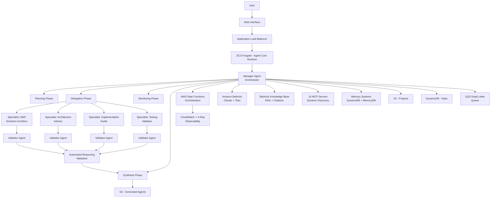
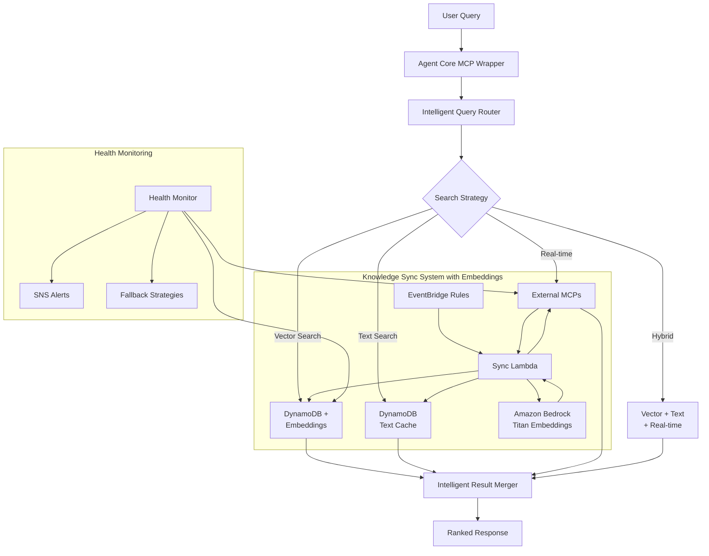
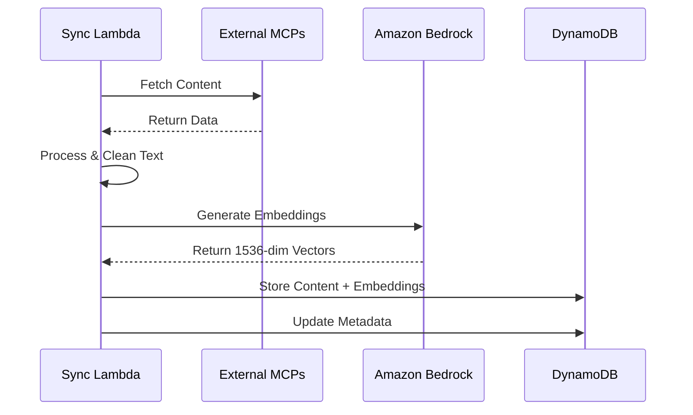
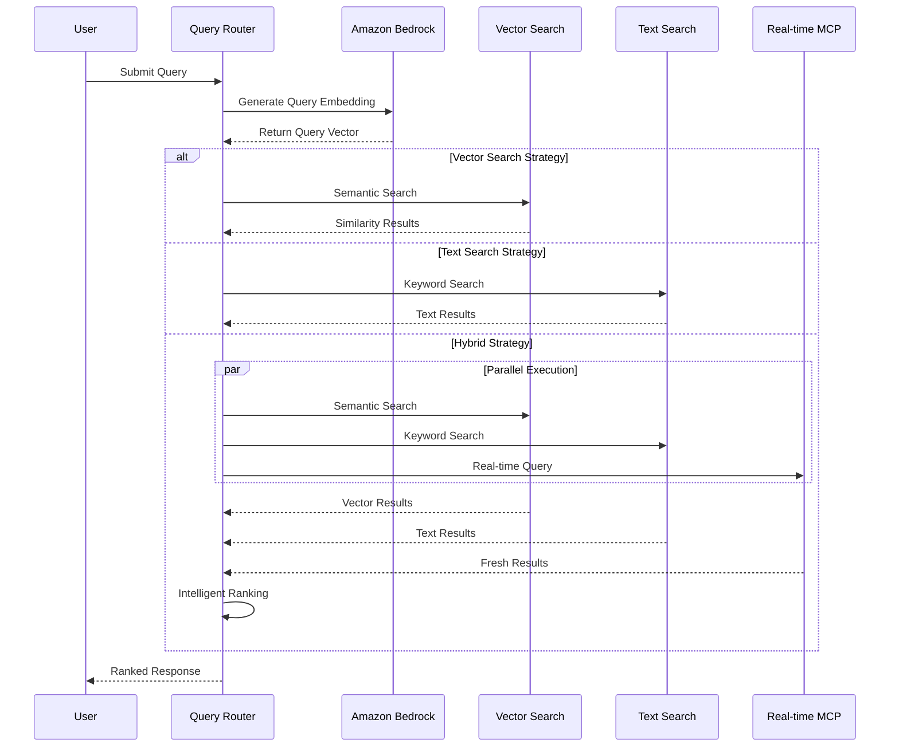
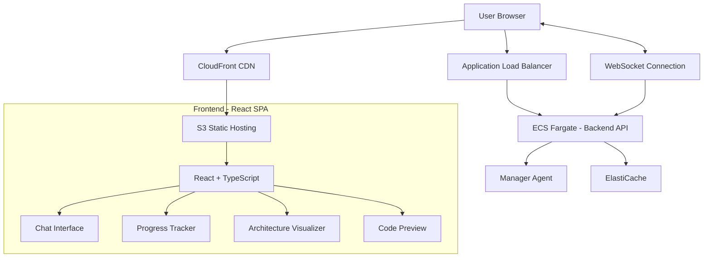
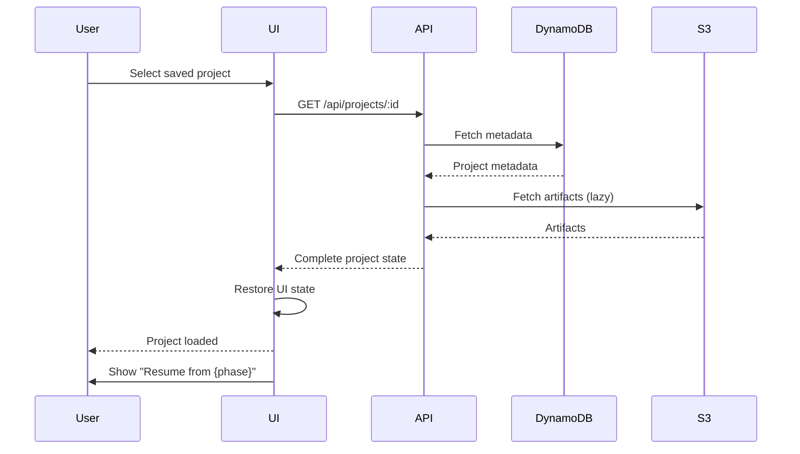
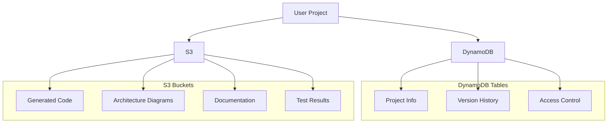
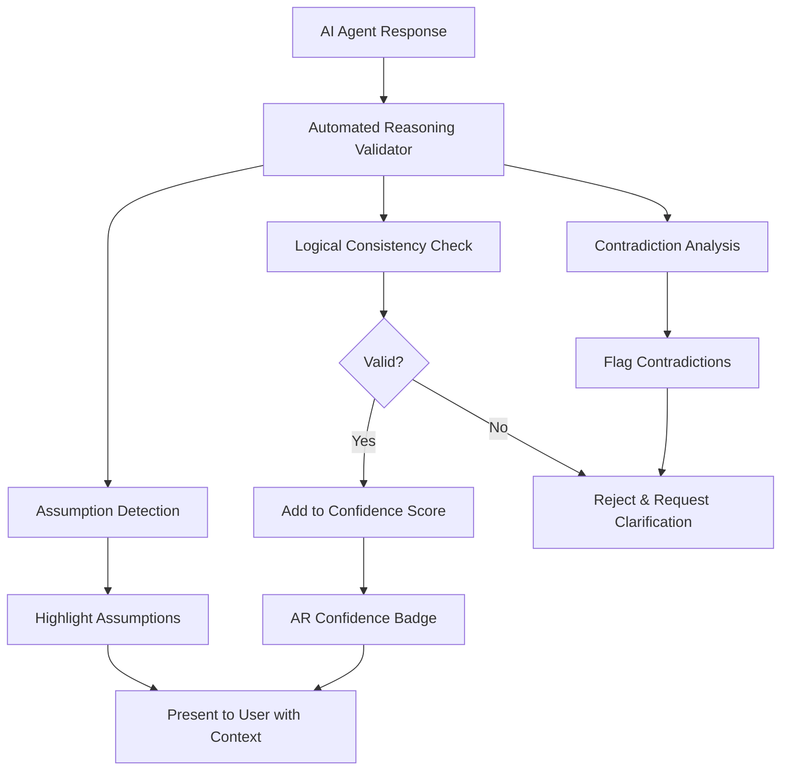
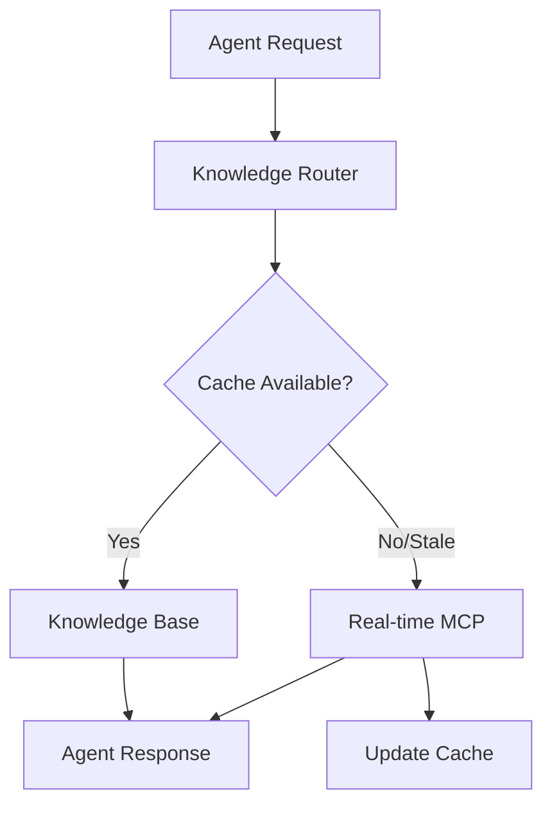

# Agent Builder Platform Design Document

## Overview

The Agent Builder Platform is an innovative educational meta-agent system designed for the AWS Agent Hackathon that democratizes Strands agent creation on AWS by leveraging 5 specialized AI consultants who teach users through guided consultation. The platform integrates 16 MCPs (AWS documentation, Strands patterns, GitHub analysis, research) and the Strands agent builder framework to create a comprehensive learning environment for building production-ready Strands agents on AWS infrastructure.

**Educational Mission**: Teach users HOW to build Strands agents on AWS, not just build them. Users learn through doing, with AI mentors explaining AWS architecture, Strands framework, and best practices at every step.

### Key Innovation Points
- **Educational Meta-Agent Architecture**: 5 AI consultant mentors teaching users to build Strands agents on AWS
- **Strands + AWS Focus**: Specifically designed to teach Strands agent builder framework with AWS infrastructure
- **Comprehensive MCP Ecosystem**: 16 specialized MCPs (12 AWS + GitHub Analysis + Perplexity Research + Strands Patterns + Filesystem) with intelligent routing
- **95%+ Confidence System**: Multi-factor confidence scoring with intelligent query routing across all MCP sources
- **Advanced Vector Search Intelligence**: Semantic understanding using Amazon Bedrock Titan embeddings (1536 dimensions) with cosine similarity search
- **Consultative Teaching Approach**: AWS Solutions Architect, Architecture Advisor, Implementation Guide, Testing Validator, and Strands Integration consultants who explain WHY and HOW
- **Progressive Disclosure**: Adapts teaching to user experience level (beginner to expert)
- **Active Listening**: Validates understanding at each phase with check-ins
- **Research & Discovery Integration**: Real-time research via Perplexity MCP and repository analysis via GitHub MCP
- **Production-Ready Output + Knowledge**: Complete Strands agent on AWS + understanding of how to build more
- **Community Tool Leverage**: Built on proven Strands agent builder framework with AWS best practices

## Architecture

### High-Level Architecture (Hierarchical Multi-Agent System)



### Hybrid Serverless Architecture Strategy
- **Amazon Bedrock**: Core LLM for agent orchestration (free tier: 20K tokens/month)
- **ECS Fargate**: Container hosting for Agent Core runtime (free tier: 20GB-hours/month)
- **AWS Lambda**: Serverless knowledge synchronization handlers (free tier: 1M requests/month)
- **DynamoDB**: Serverless knowledge cache with TTL and encryption (free tier: 25GB)
- **EventBridge**: Serverless scheduling for automated sync (free tier: 14M events/month)
- **Amazon S3**: Static storage for projects and generated agents (free tier: 5GB)
- **CloudWatch**: Serverless monitoring and alerting (free tier: 5GB logs)
- **SNS**: Serverless notifications for health alerts (free tier: 1M publishes/month)

### Enhanced MCP Integration Architecture with Vector Search
- **Comprehensive MCP Ecosystem**: 16 specialized MCPs covering all domains:
  - **12 AWS MCPs**: Documentation, Well-Architected, Solutions, Security, Serverless, Containers, AI/ML, Pricing, DevOps, Monitoring, Networking, Agent Core Patterns
  - **Research & Discovery MCPs**: GitHub Analysis, Perplexity Research, Strands Patterns, Filesystem
- **Hybrid Knowledge Access with Vector Search**: DynamoDB caching with Amazon Bedrock Titan embeddings (1536 dimensions) + real-time MCP fallback across all 16 sources + intelligent result ranking
- **95% Confidence Baseline System**: Multi-factor confidence scoring with 95% minimum threshold enforcement (information completeness 25%, requirement clarity 20%, technical feasibility 20%, validation coverage 15%, risk assessment 10%, user alignment 10%)
- **Consultative Communication Framework**: Active listening patterns, collaborative language, progressive disclosure, and regular check-ins ensuring users feel consulted throughout
- **Advanced Query Intelligence**: Multi-dimensional query analysis with intent detection, semantic understanding, and specialized routing to appropriate MCPs (AWS for infrastructure, GitHub for code analysis, Perplexity for research, Strands for patterns)
- **Vector Search Enhancement**: Amazon Bedrock Titan embeddings for semantic query understanding across all knowledge sources with 0.7 similarity threshold, automatic fallback to text search, and cost optimization (~$0.50/month)
- **Intelligent Multi-MCP Routing**: Advanced routing (semantic queries→vector search across all sources, research→Perplexity MCP, repository analysis→GitHub MCP, agent patterns→Strands MCP, AWS services→specialized AWS MCPs, complex→multi-source synthesis with vector enhancement)
- **Health Monitoring**: Continuous health checks across all 16 MCPs with automatic fallback, confidence validation, and vector search performance monitoring
- **Knowledge Synchronization**: Automated 2-3x weekly sync via EventBridge + Lambda with embedding generation for all MCP sources, vector storage, and freshness tracking
- **Agent Core Integration**: Seamless MCP wrapper for Agent Core framework with production-ready guidance, vector search capabilities, and multi-MCP orchestration

### Hierarchical Multi-Agent Architecture

#### Agent Role Hierarchy

**Manager Agent (Orchestrator)**
- **Role**: Coordinates entire agent creation workflow
- **Responsibilities**:
  - Planning Phase: Decompose complex tasks into manageable subtasks
  - Delegation Phase: Assign tasks to appropriate specialist agents
  - Monitoring Phase: Track progress, handle failures, trigger retries
  - Synthesis Phase: Combine results, validate completeness, ensure consistency
- **Capabilities**: Task decomposition, agent coordination, state management, quality assurance
- **Reasoning Mode**: Automated Reasoning enabled for critical decisions
- **Validation**: Self-review + peer-review with 0.85 confidence threshold

**Specialist Agents**
1. **AWS Solutions Architect Agent**
   - Domain: AWS architecture, cost optimization, security best practices
   - Knowledge Sources: 12 AWS MCPs, Bedrock Knowledge Base, pricing APIs
   - Validation: Architecture consistency, cost completeness, security coverage

2. **Architecture Advisor Agent**
   - Domain: Well-Architected Framework, design patterns, MCP recommendations
   - Knowledge Sources: Well-Architected MCP, GitHub Analysis, Strands Patterns
   - Validation: Design consistency, trade-off analysis, scalability verification

3. **Implementation Guide Agent**
   - Domain: Code generation, AWS SDK integration, testing frameworks
   - Knowledge Sources: GitHub Analysis, Strands Patterns, code repositories
   - Validation: Code-architecture alignment, dependency completeness, security implementation

4. **Testing Validator Agent**
   - Domain: Security validation, performance benchmarking, deployment verification
   - Knowledge Sources: Security MCP, DevOps MCP, monitoring patterns
   - Validation: Test coverage, security completeness, performance requirements

**Validator Agents**
- **Role**: Review specialist agent outputs before approval
- **Responsibilities**:
  - Accuracy verification against requirements
  - Completeness checking (no missing components)
  - Logical consistency validation
  - Cross-agent contradiction detection
- **Integration**: Automated Reasoning for mathematical verification
- **Output**: Pass/Retry decision with specific feedback

#### Self-Correction Mechanisms

**Reflection and Validation Loop**
```
Task Assignment
    ↓
Specialist Agent Execution
    ↓
Self-Review (Chain-of-Thought)
    ↓
Confidence Scoring
    ↓
[Confidence < 0.85?] → Retry with Reflection
    ↓
Validator Agent Review
    ↓
Automated Reasoning Check
    ↓
[Validation Failed?] → Feedback Loop to Specialist
    ↓
Manager Agent Synthesis
    ↓
Task Complete
```

**Multi-Model Validation for Critical Decisions**
- Security policies: Ensemble voting across Claude, Titan, and specialized models
- Cost calculations: Cross-validation with pricing APIs and historical data
- Architecture decisions: Validation against Well-Architected Framework principles

**Error Handling Strategy**
```typescript
interface ErrorHandlingConfig {
  maxRetries: 3
  backoffStrategy: 'exponential_with_jitter'
  fallbackStrategies: [
    'simpler_model',
    'cached_knowledge',
    'human_in_the_loop'
  ]
  circuitBreaker: {
    failureThreshold: 5,
    timeout: 60000,
    resetTimeout: 300000
  }
  deadLetterQueue: 'agent-failures-dlq'
}
```

### Core Components (Agent Core + AWS + Knowledge Base)

1. **Manager Agent (Orchestrator)**: Coordinates hierarchical multi-agent workflow with task decomposition and synthesis
2. **Specialist Agent Pool**: Domain-specific agents (AWS, architecture, implementation, testing) with self-review capabilities
3. **Validator Agent System**: Independent validation layer with Automated Reasoning integration
4. **AWS Step Functions**: Orchestration engine with checkpoints, state management, and error handling
5. **Hybrid MCP Architecture**: 16 MCP servers with dynamic discovery and intelligent routing
6. **RAG Knowledge System**: Bedrock Knowledge Bases with OpenSearch, citation tracking, and versioning
7. **Memory Systems**: 
   - Short-term: DynamoDB (conversation history, session state)
   - Long-term: S3 + embeddings (successful patterns, failure analysis)
   - Episodic: Task execution logs (pattern recognition)
   - Fast retrieval: MemoryDB/ElastiCache
8. **ECS-Hosted Platform**: Containerized Agent Core application running on ECS Fargate
9. **Observability Stack**: CloudWatch metrics, X-Ray tracing, custom accuracy metrics, A/B testing framework
10. **Security Layer**: IAM roles, Secrets Manager, KMS encryption, audit trails

## Components and Interfaces

### Agent Orchestrator
**Purpose**: Coordinates the multi-agent workflow and manages user interactions

**Key Methods**:
- `initializeAgentCreation(userInput)`: Starts the agent creation process
- `coordinateAgents(phase, context)`: Manages agent collaboration
- `handleUserFeedback(feedback)`: Processes user input and updates workflow
- `generateFinalAgent(specifications)`: Triggers final agent generation

### Specialized Helper Agents

#### Requirements Agent (AWS Solutions Architect Persona)
**Purpose**: Acts as an experienced AWS Solutions Architect to analyze user needs and translate them into comprehensive technical requirements

**Expert Capabilities**:
- **Consultative Questioning**: Asks intelligent, context-aware questions like a real AWS consultant
- **Cost-Aware Analysis**: Considers AWS pricing, free tier limits, and long-term cost implications
- **Security-First Approach**: Applies AWS security best practices and compliance requirements from the start
- **Use Case Pattern Matching**: Recognizes common business scenarios and recommends proven AWS architectures
- **Progressive Complexity**: Adapts technical depth based on user's AWS experience level
- **Business Impact Focus**: Explains technical decisions in terms of business value and ROI

**Communication Style**:
- Professional but approachable, like a senior consultant
- Explains "why" behind every recommendation
- Provides context about AWS services and their benefits
- Uses business language while maintaining technical accuracy

#### Architecture Agent (AWS Well-Architected Expert Persona)
**Purpose**: Acts as a senior AWS architect specializing in the Well-Architected Framework to design optimal, scalable, and cost-effective solutions

**Expert Capabilities**:
- **Well-Architected Framework**: Applies all five pillars (Security, Reliability, Performance, Cost, Sustainability)
- **Cost Optimization Engine**: Provides detailed cost analysis with pricing estimates and optimization recommendations
- **MCP Integration Expertise**: Analyzes and recommends optimal MCP combinations for specific use cases
- **Security Architecture**: Designs security-first architectures with proper IAM, encryption, and compliance
- **Scalability Planning**: Considers current needs and future growth with appropriate AWS service selection
- **Multi-Region Strategy**: Recommends availability zone and region strategies for reliability

**Communication Style**:
- Explains architectural decisions with clear rationale
- Provides cost-benefit analysis for each recommendation
- Compares alternative approaches with pros/cons
- Uses diagrams and visual explanations when helpful

#### Implementation Agent (Senior Developer Persona)
**Purpose**: Acts as a senior developer with expertise in agent development, AWS services, and production-ready code generation

**Expert Capabilities**:
- **Strands Builder Mastery**: Expert-level usage of Strands agent builder with best practices
- **Production-Ready Code**: Generates code with proper error handling, logging, and monitoring
- **AWS Integration**: Seamlessly integrates AWS services with proper SDK usage and optimization
- **Security Implementation**: Implements security best practices including input validation and secure configurations
- **Documentation Generation**: Creates comprehensive code documentation and usage guides
- **Testing Framework**: Includes unit tests and integration tests for generated agents

**Communication Style**:
- Explains code patterns and why they were chosen
- Provides implementation alternatives when appropriate
- Documents code thoroughly with clear comments
- Explains deployment and maintenance procedures

#### Testing Agent (DevOps/Security Expert Persona)
**Purpose**: Acts as a senior DevOps engineer and security expert to comprehensively validate and optimize the generated agent

**Expert Capabilities**:
- **Security Validation**: Performs thorough security assessments including vulnerability scanning and compliance checking
- **Performance Benchmarking**: Tests performance against AWS service limits and provides optimization recommendations
- **Cost Analysis**: Validates actual costs against estimates and identifies optimization opportunities
- **AWS Integration Testing**: Tests all AWS service integrations with proper error handling and retry logic
- **Load Testing**: Simulates realistic usage patterns to validate scalability and performance
- **Monitoring Setup**: Configures comprehensive monitoring, alerting, and observability

**Communication Style**:
- Provides detailed test results with clear pass/fail criteria
- Explains performance metrics and their business impact
- Offers specific optimization recommendations with expected benefits
- Identifies potential issues before they become problems

### Comprehensive MCP Integration System

#### Enhanced Hybrid Knowledge Architecture with Vector Search


### Hybrid Vector Storage Architecture (Design Phase)

**Purpose**: Optimize vector storage costs while maintaining performance through intelligent tiering

**Storage Strategy**:
- **Hot Tier (DynamoDB)**: 20% of vectors - recent, frequently accessed, high confidence (>0.85)
- **Cold Tier (S3)**: 80% of vectors - historical, infrequent access, lower confidence (0.70-0.85)
- **Cost Savings**: 83% reduction vs DynamoDB-only ($0.43/month vs $2.50/month for 10K vectors)

**Intelligent Tiering**:
- **Promotion (S3 → DynamoDB)**: Access frequency > 5/week, confidence > 0.85, real-time needs
- **Demotion (DynamoDB → S3)**: Age > 30 days AND access < 5/month, confidence < 0.70

**Query Routing**:
- **Real-time queries** → Hot tier only (DynamoDB, <1ms latency)
- **Historical queries** → Cold tier only (S3, 50-100ms latency)
- **General queries** → Hybrid search (both tiers, 10-60ms latency)

**Implementation Status**: Design documentation complete, implementation deferred to post-MVP

**Documentation**: See `docs/HYBRID-VECTOR-STORAGE-ARCHITECTURE.md` for complete technical specification

### Vector Search Architecture Details

#### Embedding Generation Process


#### Query Processing with Vector Search


#### MCP Service Interfaces

**AWS Documentation MCP Interface**:
```typescript
interface AWSDocsMCP {
  searchDocumentation(query: string): Promise<DocumentationResult[]>
  getServiceDetails(serviceName: string): Promise<ServiceDetails>
  findBestPractices(useCase: string): Promise<BestPractice[]>
  getPricingInfo(service: string): Promise<PricingDetails[]>
}
```

**Strands MCP Interface**:
```typescript
interface StrandsMCP {
  getAgentTemplates(): Promise<AgentTemplate[]>
  searchCapabilities(requirements: string[]): Promise<Capability[]>
  getImplementationExamples(capability: string): Promise<Example[]>
}
```

### Strands Builder Interface

**Purpose**: Wrapper for the GitHub Strands agent builder

```typescript
interface StrandsBuilderInterface {
  generateAgent(specification: AgentSpec): Promise<GeneratedAgent>
  validateSpecification(spec: AgentSpec): Promise<ValidationResult>
  getAvailableCapabilities(): Promise<Capability[]>
  buildConfiguration(requirements: Requirements): Promise<AgentConfig>
}
```

### Confidence and Consultation Architecture (Requirement 20)

**Purpose**: Ensure 95% confidence baseline with transparent reasoning and consultative communication patterns that make users feel confident and consulted throughout the experience

#### Enhanced Confidence Scoring System

**Multi-Factor Confidence Framework**:
```typescript
interface EnhancedConfidenceScore {
  // Core factors (weighted)
  informationCompleteness: number      // 25% weight - Do we have all needed info?
  requirementClarity: number           // 20% weight - Are requirements clear?
  technicalFeasibility: number         // 20% weight - Can we build this?
  validationCoverage: number           // 15% weight - Have we validated assumptions?
  riskAssessment: number               // 10% weight - What are the risks?
  userAlignment: number                // 10% weight - Does this match user goals?
  
  // Composite score (weighted average)
  overallConfidence: number
  
  // Transparency
  confidenceBoosters: string[]         // What increases confidence?
  uncertaintyFactors: string[]         // What reduces confidence?
  recommendedActions: string[]         // How to improve confidence?
  
  // Baseline enforcement
  meetsBaseline(): boolean             // Check if >= 95%
}
```

**Confidence Calculation Service**:
```typescript
class ConfidenceCalculationService {
  /**
   * Calculate multi-factor confidence score
   * Enforces 95% baseline - agents refuse to respond below this
   */
  async calculateConfidence(
    analysis: RequirementsAnalysis | ArchitectureDesign | Implementation
  ): Promise<EnhancedConfidenceScore> {
    // Calculate each factor
    const factors = {
      informationCompleteness: this.assessInformationCompleteness(analysis),
      requirementClarity: this.assessRequirementClarity(analysis),
      technicalFeasibility: this.assessTechnicalFeasibility(analysis),
      validationCoverage: this.assessValidationCoverage(analysis),
      riskAssessment: this.assessRisks(analysis),
      userAlignment: this.assessUserAlignment(analysis)
    }
    
    // Weighted average
    const overallConfidence = 
      factors.informationCompleteness * 0.25 +
      factors.requirementClarity * 0.20 +
      factors.technicalFeasibility * 0.20 +
      factors.validationCoverage * 0.15 +
      factors.riskAssessment * 0.10 +
      factors.userAlignment * 0.10
    
    // Identify boosters and uncertainties
    const confidenceBoosters = this.identifyBoosters(factors, analysis)
    const uncertaintyFactors = this.identifyUncertainties(factors, analysis)
    const recommendedActions = this.generateActions(uncertaintyFactors)
    
    return {
      ...factors,
      overallConfidence,
      confidenceBoosters,
      uncertaintyFactors,
      recommendedActions,
      meetsBaseline: () => overallConfidence >= 0.95
    }
  }
  
  /**
   * Multi-source validation to boost confidence
   * 5% boost (capped at 98%) when all sources agree with >90% alignment
   */
  async multiSourceValidation(
    recommendation: Recommendation
  ): Promise<number> {
    const validations = await Promise.all([
      this.validateWithMCPs(recommendation),        // 30% weight
      this.validateWithVectorSearch(recommendation), // 25% weight
      this.validateWithWAF(recommendation),          // 25% weight
      this.validateWithCostModel(recommendation)     // 20% weight
    ])
    
    // Weighted confidence
    let confidence = 
      validations[0] * 0.30 +
      validations[1] * 0.25 +
      validations[2] * 0.25 +
      validations[3] * 0.20
    
    // Boost if all sources strongly agree
    if (validations.every(v => v > 0.90)) {
      confidence = Math.min(0.98, confidence * 1.05) // 5% boost, cap at 98%
      logger.info('Confidence boosted: All sources agree with >90% alignment')
    }
    
    return confidence
  }
}
```

**Uncertainty Quantification System**:
```typescript
interface UncertaintyAnalysis {
  knownKnowns: string[]              // What we're certain about
  knownUnknowns: string[]            // What we know we don't know
  assumedKnowns: string[]            // What we're assuming (risky!)
  
  /**
   * Calculate confidence penalty
   * - Each known_unknown: -3% confidence
   * - Each assumption: -2% confidence
   * - Total penalty capped at 20%
   */
  calculateConfidencePenalty(): number {
    const unknownPenalty = this.knownUnknowns.length * 0.03
    const assumptionPenalty = this.assumedKnowns.length * 0.02
    return Math.min(0.20, unknownPenalty + assumptionPenalty)
  }
}

class UncertaintyTracker {
  /**
   * Track uncertainties throughout workflow
   * Proactively ask clarifying questions when confidence drops
   */
  async trackUncertainties(
    phase: WorkflowPhase,
    analysis: any
  ): Promise<UncertaintyAnalysis> {
    const uncertainty: UncertaintyAnalysis = {
      knownKnowns: [],
      knownUnknowns: [],
      assumedKnowns: []
    }
    
    // Identify certainties
    if (analysis.userGoals) uncertainty.knownKnowns.push('User goals clearly stated')
    if (analysis.budget) uncertainty.knownKnowns.push('Budget constraints defined')
    
    // Identify unknowns
    if (!analysis.expectedLoad) uncertainty.knownUnknowns.push('Expected user load unknown')
    if (!analysis.compliance) uncertainty.knownUnknowns.push('Compliance requirements not specified')
    
    // Identify assumptions
    if (analysis.assumedLoad) uncertainty.assumedKnowns.push(`Assuming ${analysis.assumedLoad} users/day`)
    if (analysis.assumedRegion) uncertainty.assumedKnowns.push(`Assuming ${analysis.assumedRegion} region`)
    
    return uncertainty
  }
}
```

#### Consultative Communication Framework

**Communication Pattern Service**:
```typescript
class ConsultativeCommunicationService {
  /**
   * Convert directive language to consultative patterns
   * "You must..." → "Let's explore..."
   */
  makeConsultative(content: string): string {
    const patterns = [
      { from: /You must/gi, to: 'I recommend' },
      { from: /Do this/gi, to: 'What if we' },
      { from: /The only way is/gi, to: 'The best approach is' },
      { from: /This is wrong/gi, to: 'I see a potential issue here' },
      { from: /Obviously/gi, to: 'Based on AWS best practices' },
      { from: /Just use/gi, to: 'I suggest using' }
    ]
    
    let consultative = content
    for (const pattern of patterns) {
      consultative = consultative.replace(pattern.from, pattern.to)
    }
    
    return consultative
  }
  
  /**
   * Format response with consultative structure
   */
  formatConsultativeResponse(
    recommendation: Recommendation,
    confidence: EnhancedConfidenceScore
  ): string {
    return `
Based on your requirements, let's explore this approach:

${recommendation.content}

**Why I'm confident (${(confidence.overallConfidence * 100).toFixed(0)}%):**
${confidence.confidenceBoosters.map(b => `- ${b}`).join('\n')}

**What I'm assuming:**
${confidence.uncertaintyFactors.map(u => `- ${u}`).join('\n')}

**Alternative approaches:**
${this.formatAlternatives(recommendation.alternatives)}

Does this align with your vision? Would you like me to explore 
any alternatives or adjust this approach?
    `.trim()
  }
}
```

**Active Listening Service**:
```typescript
class ActiveListeningService {
  /**
   * Validate understanding before proceeding
   * Implements active listening loop
   */
  async validateUnderstanding(
    userInput: string,
    agentInterpretation: any
  ): Promise<boolean> {
    // Summarize understanding
    const summary = `
Let me make sure I understand correctly:

You want to build: ${agentInterpretation.description}

Key requirements I heard:
${agentInterpretation.requirements.map((r, i) => `${i + 1}. ${r}`).join('\n')}

Is this accurate? Anything I missed or misunderstood?
    `.trim()
    
    // Ask user for confirmation
    const confirmation = await this.askUser(summary)
    
    if (!confirmation.approved) {
      // Iterate based on feedback
      const updated = this.updateUnderstanding(
        agentInterpretation,
        confirmation.feedback
      )
      return this.validateUnderstanding(userInput, updated)
    }
    
    return true
  }
  
  /**
   * Regular check-ins at each phase
   */
  async checkIn(phase: WorkflowPhase, output: any): Promise<boolean> {
    const prompts = {
      requirements: `
I've analyzed your requirements. Before I design the architecture:

- Use case: ${output.useCase}
- Expected load: ${output.load}
- Budget: ${output.budget}
- Key features: ${output.features.join(', ')}

Does this capture your vision? Anything I missed?
      `,
      architecture: `
I've designed an architecture for your requirements:

- Pattern: ${output.pattern}
- Key services: ${output.services.join(', ')}
- Estimated cost: ${output.cost}
- Scalability: ${output.scalability}

Does this align with what you had in mind? Any concerns?
      `,
      implementation: `
I've generated the code and infrastructure:

- ${output.fileCount} files created
- Security: ${output.securityFeatures.join(', ')}
- Testing: ${output.testCoverage}% coverage
- Documentation: Complete

Would you like to review before we proceed to testing?
      `
    }
    
    const prompt = prompts[phase]
    const response = await this.askUser(prompt)
    
    return response.approved
  }
}
```

**Progressive Disclosure Service**:
```typescript
class ProgressiveDisclosureService {
  /**
   * Adapt technical depth to user experience level
   */
  explainConcept(
    concept: string,
    experienceLevel: 'beginner' | 'intermediate' | 'advanced' | 'expert'
  ): string {
    const explanations = {
      lambda: {
        beginner: `
Lambda is like a vending machine for code - you only pay when 
someone uses it, not for keeping it running 24/7. Perfect for 
your chatbot because you won't pay anything when nobody's using it.

Cost: $0 for first 1 million requests/month (free tier)
        `,
        intermediate: `
Lambda is AWS's serverless compute service. It auto-scales based 
on demand and you only pay per request. For your chatbot API:

- No server management required
- Scales automatically from 0 to thousands of requests
- Free tier: 1M requests/month + 400K GB-seconds compute
- Cost after free tier: $0.20 per 1M requests
        `,
        advanced: `
Lambda provides event-driven compute with automatic scaling. 
For your chatbot architecture:

- Execution: 128MB-10GB memory, 15min max duration
- Concurrency: 1000 concurrent executions (soft limit)
- Cold starts: ~100-200ms for Python, mitigated with provisioned concurrency
- Integration: Native with API Gateway, DynamoDB, EventBridge
- Cost: $0.20/1M requests + $0.0000166667/GB-second
- Optimization: Use ARM64 (Graviton2) for 20% cost savings
        `,
        expert: `
Lambda architecture considerations:

- Runtime: Python 3.11 on ARM64 (Graviton2) for optimal price/performance
- Memory: 512MB (balance between cost and cold start)
- Concurrency: Reserved concurrency for predictable performance
- VPC: Only if needed (adds cold start latency)
- Layers: Shared dependencies to reduce deployment package size
- Monitoring: X-Ray tracing, CloudWatch Insights, custom metrics
- Cost optimization: Compute Savings Plans for predictable workloads
        `
      }
    }
    
    return explanations[concept]?.[experienceLevel] || explanations[concept].intermediate
  }
}
```

**Options Presentation Service**:
```typescript
class OptionsPresentationService {
  /**
   * Present 2-3 alternatives with clear trade-offs
   * Not dictates, but recommendations with reasoning
   */
  presentOptions(
    requirements: Requirements,
    options: ArchitectureOption[]
  ): string {
    const formatted = options.map((option, index) => `
**Option ${index + 1}: ${option.name}${index === 0 ? ' (Recommended)' : ''}**
- Services: ${option.services.join(', ')}
- Pros: ${option.pros.join(', ')}
- Cons: ${option.cons.join(', ')}
- Cost: ${option.cost}
- Best for: ${option.bestFor}
- Confidence: ${(option.confidence * 100).toFixed(0)}%
    `).join('\n')
    
    return `
Based on your requirements, I see ${options.length} solid approaches:

${formatted}

**My Recommendation**: ${options[0].name}

Why? ${options[0].reasoning}

What do you think? Would you like to explore any of these options 
in more detail?
    `.trim()
  }
}
```

#### Continuous Validation System

**Validation Loop Service**:
```typescript
class ContinuousValidationService {
  /**
   * Maintain confidence throughout workflow
   * Enhance when confidence drops below 90%
   */
  async validateWorkflow(userRequest: string): Promise<AgentOutput> {
    const confidenceHistory: Array<{phase: string, confidence: EnhancedConfidenceScore}> = []
    
    // Phase 1: Requirements
    let requirements = await this.gatherRequirements(userRequest)
    let reqConfidence = await this.calculateConfidence(requirements)
    confidenceHistory.push({ phase: 'requirements', confidence: reqConfidence })
    
    // Enforce 95% baseline
    if (!reqConfidence.meetsBaseline()) {
      logger.info(`Requirements confidence ${reqConfidence.overallConfidence:.1%} below baseline`)
      logger.info(`Actions: ${reqConfidence.recommendedActions}`)
      
      requirements = await this.enhanceRequirements(
        requirements,
        reqConfidence.recommendedActions
      )
      reqConfidence = await this.calculateConfidence(requirements)
    }
    
    // Check in with user
    const reqApproved = await this.activeListening.checkIn('requirements', requirements)
    if (!reqApproved) {
      requirements = await this.iterateWithFeedback(requirements)
    }
    
    // Phase 2: Architecture
    let architecture = await this.designArchitecture(requirements)
    let archConfidence = await this.calculateConfidence(architecture)
    confidenceHistory.push({ phase: 'architecture', confidence: archConfidence })
    
    // Cross-phase validation
    const alignment = await this.validateAlignment(requirements, architecture)
    if (alignment < 0.95) {
      architecture = await this.realignArchitecture(architecture, requirements)
    }
    
    // Enforce baseline
    if (!archConfidence.meetsBaseline()) {
      architecture = await this.enhanceArchitecture(architecture)
      archConfidence = await this.calculateConfidence(architecture)
    }
    
    // Check in with user
    const archApproved = await this.activeListening.checkIn('architecture', architecture)
    if (!archApproved) {
      architecture = await this.iterateWithFeedback(architecture)
    }
    
    // Phase 3: Implementation (similar pattern)
    // ...
    
    return {
      requirements,
      architecture,
      implementation,
      confidenceHistory
    }
  }
}
```

#### Confidence Monitoring Dashboard

**Monitoring Service**:
```typescript
class ConfidenceMonitoringService {
  /**
   * Real-time confidence and consultation quality monitoring
   */
  async monitorSession(sessionId: string): Promise<void> {
    while (await this.isSessionActive(sessionId)) {
      // Get current metrics
      const confidence = await this.getSessionConfidence(sessionId)
      const consultationScore = await this.getConsultationScore(sessionId)
      
      // Alert if confidence drops below baseline
      if (confidence < 0.95) {
        await this.alertLowConfidence(sessionId, confidence)
      }
      
      // Alert if consultation quality drops
      if (consultationScore < 0.85) {
        await this.alertPoorConsultation(sessionId, consultationScore)
      }
      
      // Track trends
      await this.trackMetrics(sessionId, {
        confidence,
        consultationScore,
        timestamp: Date.now()
      })
      
      await this.sleep(5000) // Check every 5 seconds
    }
  }
  
  /**
   * Calculate consultation quality score
   */
  async getConsultationScore(sessionId: string): Promise<number> {
    const session = await this.getSession(sessionId)
    
    const metrics = {
      activeListeningScore: this.calculateActiveListeningScore(session),
      clarifyingQuestionsAsked: session.clarifyingQuestions.length,
      optionsPresented: session.optionsPresented.length,
      checkInsPerformed: session.checkIns.length,
      reasoningExplained: session.reasoningExplanations.length
    }
    
    // Weighted score
    return (
      metrics.activeListeningScore * 0.30 +
      (Math.min(metrics.clarifyingQuestionsAsked, 5) / 5) * 0.20 +
      (Math.min(metrics.optionsPresented, 3) / 3) * 0.20 +
      (metrics.checkInsPerformed >= 1 ? 1.0 : 0.0) * 0.15 +
      (metrics.reasoningExplained > 0 ? 1.0 : 0.0) * 0.15
    )
  }
}
```

### Web Interface Architecture (Requirements 5, 12)

**Purpose**: Provide an intuitive, high-performance web interface that guides users through agent creation in 30-45 minutes with 5-second response times

**Architecture Overview**:


**Frontend Technology Stack**:
- **Framework**: React 18+ with TypeScript for type safety
- **State Management**: Redux Toolkit for global state, React Query for server state
- **UI Library**: Material-UI or Chakra UI with custom theming
- **Real-time**: WebSocket for live updates and streaming responses
- **Visualization**: D3.js or Mermaid for architecture diagrams
- **Code Display**: Monaco Editor (VS Code editor) for code preview
- **Animation**: Framer Motion for smooth transitions

**Backend API Architecture**:
```typescript
interface BackendAPI {
  // Session management
  POST   /api/sessions                    // Create new session
  GET    /api/sessions/:id                // Get session state
  DELETE /api/sessions/:id                // End session
  
  // Agent creation workflow
  POST   /api/agents/create               // Start agent creation
  POST   /api/agents/:id/requirements     // Submit requirements
  POST   /api/agents/:id/feedback         // Provide feedback
  GET    /api/agents/:id/status           // Get current status
  GET    /api/agents/:id/recommendations  // Get recommendations
  
  // Testing and validation
  POST   /api/agents/:id/test             // Run tests
  GET    /api/agents/:id/validation       // Get validation report
  
  // Export and deployment
  GET    /api/agents/:id/export           // Export agent
  POST   /api/agents/:id/deploy           // Deploy agent
  
  // Real-time updates
  WS     /ws/agents/:id                   // WebSocket for live updates
}
```

**User Interface Components**:

1. **Chat Interface** (Primary Interaction):
```typescript
interface ChatInterface {
  // Expert consultant personas with avatars
  agents: {
    solutionsArchitect: AgentPersona
    architectureAdvisor: AgentPersona
    implementationGuide: AgentPersona
    testingValidator: AgentPersona
  }
  
  // Message types
  messages: ChatMessage[]
  
  // Features
  features: {
    typewriterEffect: boolean      // Streaming responses
    codeHighlighting: boolean      // Syntax highlighting
    inlineVisualizations: boolean  // Embedded diagrams
    confidenceBadges: boolean      // AR validation badges
    assumptionHighlights: boolean  // Highlighted assumptions
  }
  
  // Performance
  responseTime: number  // Target: < 5 seconds
  streamingEnabled: boolean
}
```

2. **Progress Tracker** (Workflow Visibility):
```typescript
interface ProgressTracker {
  phases: [
    { name: 'Requirements', status: 'completed', duration: '8 min' },
    { name: 'Architecture', status: 'in_progress', duration: '12 min' },
    { name: 'Implementation', status: 'pending', duration: '15 min' },
    { name: 'Testing', status: 'pending', duration: '8 min' },
    { name: 'Deployment', status: 'pending', duration: '5 min' }
  ]
  
  totalEstimatedTime: '48 minutes'  // Target: 30-45 minutes
  elapsedTime: '20 minutes'
  currentPhase: 'Architecture'
  
  // Visual indicators
  progressBar: number  // 0-100%
  phaseIcons: boolean
  timeEstimates: boolean
}
```

3. **Architecture Visualizer** (Design Understanding):
```typescript
interface ArchitectureVisualizer {
  // Diagram types
  diagrams: {
    systemArchitecture: MermaidDiagram
    dataFlow: MermaidDiagram
    deploymentView: MermaidDiagram
  }
  
  // Interactive features
  interactive: boolean
  zoomable: boolean
  exportable: boolean  // PNG, SVG, PDF
  
  // Cost overlay
  costAnnotations: {
    service: string
    estimatedCost: number
    visible: boolean
  }[]
}
```

4. **Code Preview** (Implementation Transparency):
```typescript
interface CodePreview {
  // Monaco editor integration
  editor: MonacoEditor
  
  // Features
  syntaxHighlighting: boolean
  lineNumbers: boolean
  minimap: boolean
  readOnly: boolean
  
  // File tree
  files: FileTreeNode[]
  currentFile: string
  
  // Actions
  copyToClipboard: () => void
  downloadFile: () => void
  downloadAll: () => void
}
```

5. **Confidence Dashboard** (Trust Building):
```typescript
interface ConfidenceDashboard {
  // Overall confidence
  overallConfidence: number  // 95-98% target
  
  // Breakdown
  breakdown: {
    vectorSimilarity: number
    sourceReliability: number
    freshness: number
    automatedReasoning: number
    mcpValidation: number
  }
  
  // AR validation
  arBadge: {
    verified: boolean
    confidence: number
    assumptions: string[]
    contradictions: string[]
  }
  
  // Visual representation
  gaugeChart: boolean
  colorCoding: boolean  // Green > 95%, Yellow 85-95%, Red < 85%
}
```

**Performance Optimization (Requirement 12)**:

1. **Response Time Optimization** (5-second target):
```typescript
interface PerformanceStrategy {
  // Backend optimizations
  backend: {
    caching: 'ElastiCache for frequent queries'
    precomputation: 'Pre-generate common recommendations'
    parallelization: 'Parallel MCP queries'
    streaming: 'Stream responses as they generate'
  }
  
  // Frontend optimizations
  frontend: {
    codesplitting: 'Lazy load components'
    prefetching: 'Prefetch next phase data'
    optimisticUI: 'Show immediate feedback'
    virtualScrolling: 'Efficient large lists'
  }
  
  // Network optimizations
  network: {
    cdn: 'CloudFront for static assets'
    compression: 'Gzip/Brotli compression'
    http2: 'HTTP/2 multiplexing'
    websocket: 'Persistent connection'
  }
}
```

2. **Workflow Time Optimization** (30-45 minute target):
```typescript
interface WorkflowOptimization {
  // Smart defaults
  smartDefaults: {
    enabled: boolean
    basedOn: 'use case patterns, user experience level'
    userCanOverride: boolean
  }
  
  // Progressive disclosure
  progressiveComplexity: {
    beginners: 'Simple questions, more guidance'
    intermediate: 'Balanced detail'
    experts: 'Technical depth, less hand-holding'
  }
  
  // Parallel processing
  parallelization: {
    mcpQueries: 'Query multiple MCPs simultaneously'
    validation: 'Run validations in parallel'
    codeGeneration: 'Generate multiple files concurrently'
  }
  
  // Skip options
  skipOptions: {
    useTemplates: 'Start from proven templates'
    acceptRecommendations: 'One-click accept all'
    minimalCustomization: 'Use defaults where possible'
  }
}
```

**User Experience Flow**:

1. **Welcome & Onboarding** (2 minutes):
   - Brief introduction to the platform
   - Experience level selection (Beginner/Intermediate/Expert)
   - Quick tutorial or skip option

2. **Requirements Phase** (8-12 minutes):
   - Natural language use case description
   - AI-guided clarifying questions
   - Progressive complexity based on user level
   - Real-time recommendations

3. **Architecture Phase** (10-15 minutes):
   - AI-generated architecture proposal
   - Interactive diagram with cost annotations
   - Trade-off explanations
   - User feedback and refinement

4. **Implementation Phase** (10-15 minutes):
   - Automated code generation
   - Real-time progress updates
   - Code preview with explanations
   - Strands builder integration

5. **Testing Phase** (5-8 minutes):
   - Automated test execution
   - Validation report with visualizations
   - Issue resolution guidance
   - Performance metrics

6. **Deployment Phase** (3-5 minutes):
   - Export options (code, configs, scripts)
   - Deployment instructions
   - Cost summary and monitoring setup
   - Success confirmation

**Accessibility and Usability**:
- **WCAG 2.1 AA Compliance**: Screen reader support, keyboard navigation
- **Responsive Design**: Mobile, tablet, desktop optimized
- **Dark/Light Themes**: User preference and system detection
- **Internationalization**: Multi-language support (future)
- **Error Recovery**: Clear error messages, undo/redo, save progress

## Data Models

### User Project
```typescript
interface UserProject {
  id: string
  name: string
  description: string
  useCase: string
  requirements: Requirement[]
  architecture: ArchitectureSpec
  implementation: ImplementationDetails
  testResults: TestResult[]
  status: ProjectStatus
  vectorSearchEnabled: boolean
  createdAt: Date
  updatedAt: Date
  
  // Version control (Requirement 8)
  version: number
  versionHistory: ProjectVersion[]
  
  // Collaboration (Requirement 8.4)
  owner: string
  collaborators: string[]
  shareSettings: ShareSettings
}

interface ProjectVersion {
  version: number
  timestamp: Date
  changes: ChangeLog[]
  snapshot: ProjectSnapshot
  author: string
  message: string
}

interface ShareSettings {
  visibility: 'private' | 'team' | 'public'
  allowFork: boolean
  allowExport: boolean
  accessControl: AccessControl[]
}
```

## Project Persistence and Iteration System (Requirement 8)

**Purpose**: Enable users to save, restore, version, and collaborate on agent projects

### Automatic Save System

**Auto-Save Strategy**:
```typescript
interface AutoSaveSystem {
  // Trigger points
  triggers: {
    phaseCompletion: boolean      // Save after each phase
    significantChange: boolean    // Save after major decisions
    timeInterval: number          // Save every N seconds (default: 30)
    userAction: boolean           // Save on explicit user action
  }
  
  // Save operations
  saveOperation: {
    method: 'incremental'         // Only save changes
    storage: 'DynamoDB + S3'      // Metadata in DynamoDB, artifacts in S3
    encryption: 'AES-256'         // Encrypt at rest
    compression: boolean          // Compress large artifacts
  }
  
  // Save confirmation
  confirmation: {
    visual: 'Subtle indicator'    // "Saved" badge
    notification: false           // No intrusive notifications
    errorHandling: 'Retry with exponential backoff'
  }
}
```

**Save Points**:
1. **Phase Completion**: After Requirements, Architecture, Implementation, Testing phases
2. **User Decisions**: After accepting recommendations or making choices
3. **Code Generation**: After generating agent code
4. **Test Results**: After running validation tests
5. **Manual Save**: User-triggered save action

### Project Restoration

**State Restoration**:
```typescript
interface ProjectRestoration {
  // Load project
  loadProject(projectId: string): Promise<UserProject>
  
  // Restore complete state
  restoreState: {
    workflowPhase: WorkflowPhase
    conversationHistory: ChatMessage[]
    agentContext: AgentContext
    decisions: Decision[]
    generatedArtifacts: Artifact[]
    testResults: TestResult[]
  }
  
  // Resume workflow
  resumeWorkflow: {
    continueFromLastPhase: boolean
    showProgressSummary: boolean
    allowPhaseNavigation: boolean
  }
  
  // Performance
  loadTime: number  // Target: < 2 seconds
  lazyLoading: boolean  // Load artifacts on demand
}
```

**Restoration Flow**:


### Version Control System

**Versioning Strategy**:
```typescript
interface VersionControl {
  // Version creation
  createVersion: {
    automatic: boolean            // Auto-version on major changes
    manual: boolean               // User-triggered versioning
    message: string               // Version description
  }
  
  // Version metadata
  versionMetadata: {
    version: number               // Sequential version number
    timestamp: Date
    author: string
    changes: ChangeLog[]
    diffSize: number              // Size of changes
    tags: string[]                // User-defined tags
  }
  
  // Change tracking
  changeTracking: {
    granularity: 'phase-level'    // Track changes per phase
    diffAlgorithm: 'structural'   // Semantic diff, not text diff
    changeTypes: [
      'requirements_modified',
      'architecture_changed',
      'code_regenerated',
      'configuration_updated'
    ]
  }
}
```

**Version History View**:
```typescript
interface VersionHistoryView {
  // Timeline view
  timeline: {
    versions: VersionEntry[]
    visualRepresentation: 'timeline' | 'tree' | 'list'
    filtering: {
      byAuthor: boolean
      byPhase: boolean
      byDateRange: boolean
    }
  }
  
  // Version comparison
  comparison: {
    selectVersions: [number, number]
    showDiff: boolean
    highlightChanges: boolean
    impactAnalysis: {
      requirementsChanged: boolean
      architectureImpact: string[]
      codeImpact: string[]
      costImpact: number
    }
  }
  
  // Version actions
  actions: {
    view: 'View version details'
    restore: 'Rollback to this version'
    fork: 'Create new project from this version'
    export: 'Export this version'
    compare: 'Compare with another version'
  }
}
```

**Rollback Mechanism**:
```typescript
interface RollbackSystem {
  // Rollback operation
  rollback: {
    targetVersion: number
    preserveCurrent: boolean      // Save current as new version
    confirmationRequired: boolean
    impactWarning: string[]       // Warn about lost changes
  }
  
  // Rollback execution
  execution: {
    steps: [
      'Create backup of current state',
      'Load target version snapshot',
      'Restore workflow state',
      'Restore artifacts',
      'Update version pointer',
      'Notify user of completion'
    ]
    rollbackTime: number  // Target: < 5 seconds
    atomic: boolean       // All-or-nothing operation
  }
  
  // Post-rollback
  postRollback: {
    showChanges: boolean
    allowRedo: boolean
    updateTimeline: boolean
  }
}
```

### Collaboration and Sharing

**Export Functionality**:
```typescript
interface ProjectExport {
  // Export formats
  formats: {
    fullProject: {
      format: 'zip' | 'tar.gz'
      includes: [
        'project metadata',
        'requirements document',
        'architecture diagrams',
        'generated code',
        'test results',
        'deployment configs',
        'version history'
      ]
    }
    
    projectTemplate: {
      format: 'json'
      includes: [
        'requirements structure',
        'architecture patterns',
        'configuration templates'
      ]
      excludes: ['user-specific data', 'credentials']
    }
    
    documentation: {
      format: 'pdf' | 'markdown'
      includes: [
        'requirements',
        'architecture',
        'deployment guide'
      ]
    }
  }
  
  // Export options
  options: {
    includeVersionHistory: boolean
    anonymizeData: boolean
    includeCredentials: boolean  // Default: false
    compressionLevel: number
  }
}
```

**Import Functionality**:
```typescript
interface ProjectImport {
  // Import sources
  sources: {
    file: 'Upload project file'
    url: 'Import from URL'
    template: 'Start from template'
  }
  
  // Import validation
  validation: {
    formatCheck: boolean
    versionCompatibility: boolean
    securityScan: boolean
    dependencyCheck: boolean
  }
  
  // Import options
  options: {
    createNewProject: boolean
    mergeWithExisting: boolean
    importVersionHistory: boolean
    resolveConflicts: 'manual' | 'automatic'
  }
  
  // Post-import
  postImport: {
    validateIntegrity: boolean
    regenerateArtifacts: boolean
    runTests: boolean
    notifyUser: boolean
  }
}
```

**Collaboration Features**:
```typescript
interface CollaborationSystem {
  // Sharing
  sharing: {
    generateShareLink: () => string
    setPermissions: (permissions: Permission[]) => void
    expirationTime: number | null
    accessControl: {
      view: boolean
      edit: boolean
      export: boolean
      delete: boolean
    }
  }
  
  // Team collaboration
  team: {
    inviteCollaborators: (emails: string[]) => void
    roleBasedAccess: {
      owner: 'Full control'
      editor: 'Edit and save'
      viewer: 'Read-only access'
    }
    activityLog: CollaborationEvent[]
    conflictResolution: 'last-write-wins' | 'manual-merge'
  }
  
  // Project templates
  templates: {
    saveAsTemplate: () => void
    publishToGallery: boolean
    templateMetadata: {
      name: string
      description: string
      category: string
      tags: string[]
      usageCount: number
      rating: number
    }
  }
}
```

### Storage Architecture

**Data Storage Strategy**:


**Storage Optimization**:
```typescript
interface StorageOptimization {
  // DynamoDB optimization
  dynamoDB: {
    partitionKey: 'userId'
    sortKey: 'projectId#version'
    gsi: ['status-index', 'created-date-index']
    ttl: 'auto-delete old versions after 90 days'
    encryption: 'AWS managed keys'
  }
  
  // S3 optimization
  s3: {
    bucketStructure: '/projects/{userId}/{projectId}/{version}/'
    lifecycle: {
      transition: 'Move to Glacier after 30 days'
      expiration: 'Delete after 1 year'
    }
    versioning: true
    encryption: 'SSE-S3'
    compression: 'gzip for text files'
  }
  
  // Cost management
  costManagement: {
    deduplication: 'Store only diffs between versions'
    compression: 'Compress large artifacts'
    intelligentTiering: 'Auto-move to cheaper storage'
    quotas: 'Per-user storage limits'
  }
}
```

### Knowledge Item with Vector Search
```typescript
interface KnowledgeItem {
  id: string
  source: string
  contentId: string
  title: string
  content: string
  embedding?: number[]  // 1536-dimension vector from Bedrock Titan
  embeddingModel?: string  // "amazon.titan-embed-text-v1"
  embeddingGenerated?: Date
  lastUpdated: Date
  confidence: number
  metadata: {
    source_type: string
    freshness_score: number
    similarity_threshold: number
    search_method: 'vector_primary' | 'text_fallback' | 'hybrid'
  }
}
```

### Vector Search Query
```typescript
interface VectorSearchQuery {
  queryText: string
  queryEmbedding?: number[]
  similarityThreshold: number
  maxResults: number
  searchStrategy: 'vector' | 'text' | 'hybrid'
  fallbackEnabled: boolean
  confidenceBoost: number
}
```

### Search Result with Vector Metadata
```typescript
interface SearchResult {
  item: KnowledgeItem
  relevanceScore: number
  similarityScore?: number  // Cosine similarity for vector results
  searchMethod: 'vector_primary' | 'text_fallback' | 'hybrid' | 'realtime_mcp'
  confidence: number
  metadata: {
    query_understanding: string
    result_ranking_factors: string[]
    fallback_reason?: string
  }
}
```

### Agent Specification
```typescript
interface AgentSpec {
  name: string
  description: string
  capabilities: Capability[]
  mcpConnections: MCPConnection[]
  configuration: AgentConfig
  dependencies: Dependency[]
  testScenarios: TestScenario[]
}
```

### Workflow State
```typescript
interface WorkflowState {
  currentPhase: WorkflowPhase
  completedSteps: string[]
  activeAgents: string[]
  userContext: UserContext
  recommendations: Recommendation[]
  decisions: Decision[]
}
```

## Deployment and Export System (Requirement 7)

**Purpose**: Provide comprehensive export and deployment capabilities for generated agents

### Export Formats and Options

**Multi-Format Export**:
```typescript
interface ExportOptions {
  formats: {
    sourceCode: {
      language: 'python' | 'typescript' | 'javascript'
      structure: 'single-file' | 'modular' | 'package'
      includeTests: boolean
      includeDocumentation: boolean
    }
    
    containerized: {
      dockerfile: boolean
      dockerCompose: boolean
      kubernetesManifests: boolean
      helmChart: boolean
    }
    
    cloudFormation: {
      template: boolean
      parameters: boolean
      outputs: boolean
    }
    
    terraform: {
      modules: boolean
      variables: boolean
      outputs: boolean
    }
    
    configuration: {
      envFile: boolean
      configYaml: boolean
      secretsTemplate: boolean
    }
    
    documentation: {
      readme: boolean
      apiDocs: boolean
      architectureDiagram: boolean
      deploymentGuide: boolean
      troubleshootingGuide: boolean
      costAnalysis: boolean
    }
  }
  
  packaging: {
    format: 'zip' | 'tar.gz' | 'git-repo'
    includeAllDependencies: boolean
    generateLockFiles: boolean
  }
}
```

**Export Package Structure**:
```
exported-agent-{name}-{timestamp}/
├── README.md                          # Overview and quick start
├── ARCHITECTURE.md                    # Architecture documentation
├── DEPLOYMENT.md                      # Deployment instructions
├── COST_ANALYSIS.md                   # Cost breakdown and optimization
├── src/                               # Source code
│   ├── agent/                         # Agent implementation
│   ├── tools/                         # Custom tools
│   ├── config/                        # Configuration files
│   └── tests/                         # Test suites
├── infrastructure/                    # IaC templates
│   ├── cloudformation/                # CloudFormation templates
│   ├── terraform/                     # Terraform modules
│   └── kubernetes/                    # K8s manifests
├── docker/                            # Container configuration
│   ├── Dockerfile
│   ├── docker-compose.yml
│   └── .dockerignore
├── scripts/                           # Deployment scripts
│   ├── deploy.sh                      # Main deployment script
│   ├── setup-aws.sh                   # AWS setup
│   ├── test.sh                        # Run tests
│   └── cleanup.sh                     # Resource cleanup
├── docs/                              # Additional documentation
│   ├── api/                           # API documentation
│   ├── guides/                        # User guides
│   └── troubleshooting/               # Troubleshooting guides
├── .env.template                      # Environment variables template
├── requirements.txt / package.json    # Dependencies
└── LICENSE                            # License information
```

### Deployment Strategies

**1. One-Click AWS Deployment**:
```typescript
interface OneClickDeployment {
  method: 'CloudFormation Stack'
  
  steps: [
    {
      step: 1,
      action: 'Create CloudFormation stack',
      command: 'aws cloudformation create-stack --stack-name {agent-name} --template-body file://infrastructure/cloudformation/main.yaml',
      estimatedTime: '5-10 minutes',
      prerequisites: ['AWS CLI configured', 'IAM permissions']
    },
    {
      step: 2,
      action: 'Wait for stack creation',
      command: 'aws cloudformation wait stack-create-complete --stack-name {agent-name}',
      estimatedTime: '5-10 minutes'
    },
    {
      step: 3,
      action: 'Get stack outputs',
      command: 'aws cloudformation describe-stacks --stack-name {agent-name} --query "Stacks[0].Outputs"',
      outputs: ['API Endpoint', 'Agent URL', 'Monitoring Dashboard']
    }
  ]
  
  rollback: {
    automatic: true,
    onFailure: 'DELETE'
  }
}
```

**2. Container Deployment**:
```typescript
interface ContainerDeployment {
  platforms: ['ECS Fargate', 'EKS', 'Docker Compose', 'Local Docker']
  
  ecsDeployment: {
    steps: [
      'Build Docker image',
      'Push to ECR',
      'Create ECS task definition',
      'Create ECS service',
      'Configure load balancer',
      'Set up auto-scaling'
    ],
    script: './scripts/deploy-ecs.sh',
    estimatedTime: '10-15 minutes'
  }
  
  localDeployment: {
    steps: [
      'Build Docker image',
      'Run docker-compose up'
    ],
    script: 'docker-compose up -d',
    estimatedTime: '2-3 minutes'
  }
}
```

**3. Serverless Deployment**:
```typescript
interface ServerlessDeployment {
  framework: 'AWS SAM' | 'Serverless Framework'
  
  components: {
    lambda: 'Agent execution functions',
    apiGateway: 'REST API endpoints',
    dynamoDB: 'State storage',
    s3: 'Artifact storage',
    eventBridge: 'Scheduled tasks'
  }
  
  deployment: {
    command: 'sam deploy --guided',
    estimatedTime: '5-8 minutes',
    costOptimized: true
  }
}
```

### Deployment Instructions

**Step-by-Step Deployment Guide**:
```markdown
# Deployment Guide for {Agent Name}

## Prerequisites
- AWS Account with appropriate permissions
- AWS CLI installed and configured
- Docker installed (for container deployments)
- Python 3.9+ or Node.js 18+ (depending on agent)

## Quick Start (Recommended)

### Option 1: One-Click CloudFormation Deployment
```bash
# 1. Navigate to the infrastructure directory
cd infrastructure/cloudformation

# 2. Deploy the stack
aws cloudformation create-stack \
  --stack-name my-agent \
  --template-body file://main.yaml \
  --parameters file://parameters.json \
  --capabilities CAPABILITY_IAM

# 3. Wait for completion (5-10 minutes)
aws cloudformation wait stack-create-complete --stack-name my-agent

# 4. Get your agent endpoint
aws cloudformation describe-stacks \
  --stack-name my-agent \
  --query "Stacks[0].Outputs[?OutputKey=='AgentEndpoint'].OutputValue" \
  --output text
```

### Option 2: Docker Compose (Local Testing)
```bash
# 1. Set up environment variables
cp .env.template .env
# Edit .env with your configuration

# 2. Build and run
docker-compose up -d

# 3. Access your agent
curl http://localhost:8000/health
```

## Detailed Deployment Steps

[Comprehensive step-by-step instructions with screenshots]

## Configuration

### Environment Variables
- `AWS_REGION`: AWS region for deployment (default: us-east-1)
- `BEDROCK_MODEL`: Bedrock model ID (default: anthropic.claude-v2)
- `MCP_ENDPOINTS`: Comma-separated MCP server URLs
- `LOG_LEVEL`: Logging level (default: INFO)

### Cost Optimization
- Enable auto-scaling to handle variable load
- Use spot instances for non-critical workloads
- Configure DynamoDB on-demand pricing
- Set up CloudWatch alarms for cost monitoring

## Monitoring and Maintenance

### CloudWatch Dashboard
Access your monitoring dashboard:
```bash
aws cloudwatch get-dashboard --dashboard-name {agent-name}-dashboard
```

### Logs
View agent logs:
```bash
aws logs tail /aws/ecs/{agent-name} --follow
```

### Metrics
Key metrics to monitor:
- Request latency (target: < 5 seconds)
- Error rate (target: < 1%)
- Cost per request
- MCP availability

## Troubleshooting

### Common Issues

**Issue: Stack creation fails**
- Check IAM permissions
- Verify AWS service quotas
- Review CloudFormation events for specific errors

**Issue: Agent not responding**
- Check ECS task status
- Review CloudWatch logs
- Verify security group rules

**Issue: High costs**
- Review CloudWatch cost metrics
- Check for unused resources
- Optimize DynamoDB capacity

[Detailed troubleshooting guide with solutions]

## Rollback and Cleanup

### Rollback to Previous Version
```bash
aws cloudformation update-stack \
  --stack-name my-agent \
  --use-previous-template
```

### Complete Cleanup
```bash
./scripts/cleanup.sh
```

## Support
- Documentation: ./docs/
- Issues: [GitHub Issues URL]
- Community: [Discord/Slack URL]
```

### Deployment Validation

**Post-Deployment Checks**:
```typescript
interface DeploymentValidation {
  healthChecks: {
    endpoint: string
    expectedStatus: 200
    timeout: 30000
  }
  
  functionalTests: {
    testScenarios: TestScenario[]
    expectedSuccessRate: 0.99
  }
  
  performanceTests: {
    loadTest: {
      concurrentUsers: 10
      duration: 60000
      expectedResponseTime: 5000
    }
  }
  
  costValidation: {
    estimatedDailyCost: number
    actualCost: number
    variance: number
    acceptable: boolean
  }
  
  securityValidation: {
    sslEnabled: boolean
    iamRolesConfigured: boolean
    encryptionEnabled: boolean
    vulnerabilityScan: ScanResult
  }
}
```

### Deployment Failure Handling

**Failure Recovery Strategy**:
```typescript
interface FailureRecovery {
  // Automatic rollback
  automaticRollback: {
    enabled: boolean
    triggers: ['stack_creation_failed', 'health_check_failed']
    preserveLogs: boolean
  }
  
  // Troubleshooting guidance
  troubleshooting: {
    errorCode: string
    possibleCauses: string[]
    suggestedFixes: Fix[]
    documentationLinks: string[]
  }
  
  // Alternative deployment methods
  alternatives: [
    {
      method: 'Manual deployment',
      steps: string[]
      estimatedTime: string
    },
    {
      method: 'Simplified deployment',
      description: 'Deploy with minimal features',
      steps: string[]
    }
  ]
  
  // Support escalation
  support: {
    selfService: 'Documentation and troubleshooting guides',
    community: 'Community forums and Discord',
    professional: 'Contact support team'
  }
}
```

## Error Handling

### MCP Connection Failures
- **Graceful Degradation**: Continue with cached data or alternative approaches
- **User Notification**: Clear messaging about reduced functionality
- **Retry Logic**: Automatic retry with exponential backoff
- **Fallback Options**: Alternative data sources or manual input options

### Agent Builder Integration Issues
- **Version Compatibility**: Check and handle Strands builder version changes
- **Generation Failures**: Provide detailed error messages and suggested fixes
- **Configuration Errors**: Validate specifications before generation
- **Dependency Issues**: Automated dependency resolution with user confirmation

### Multi-Agent Coordination Failures
- **Agent Timeout Handling**: Fallback to single-agent mode if coordination fails
- **Conflict Resolution**: User-driven decision making when agents disagree
- **State Synchronization**: Robust state management across agent interactions
- **Recovery Mechanisms**: Ability to restart from any workflow phase

### Deployment Failures (Requirement 7.4)
- **Pre-Deployment Validation**: Check prerequisites before deployment
- **Automatic Rollback**: Revert to previous state on failure
- **Detailed Error Messages**: Specific, actionable error information
- **Alternative Methods**: Provide fallback deployment options
- **Troubleshooting Guides**: Step-by-step resolution procedures
- **Support Escalation**: Clear path to get help when needed

## Automated Reasoning Integration

### Purpose
Integrate AWS Automated Reasoning checks to validate all AI agent responses for logical consistency, detect hallucinations, and highlight unstated assumptions, ensuring 95%+ confidence in recommendations.

### Architecture



### Core Components

#### Automated Reasoning Validator
**Purpose**: Validates all agent responses before presenting to users

**Key Methods**:
- `validateLogicalConsistency(response, context)`: Checks for logical soundness
- `detectUnstatedAssumptions(response, requirements)`: Identifies hidden assumptions
- `checkContradictions(response, priorResponses)`: Finds conflicting statements
- `verifyCompleteness(response, requirements)`: Ensures all requirements addressed
- `calculateARConfidence(validationResults)`: Computes AR-based confidence score

**Validation Rules**:
```typescript
interface AutomatedReasoningRules {
  // Architecture validation
  architectureConsistency: {
    rule: "All components must have defined interfaces"
    check: "No orphaned dependencies or circular references"
    assumption: "Highlight any assumed infrastructure or services"
  }
  
  // Cost validation
  costCompleteness: {
    rule: "All AWS services must have cost estimates"
    check: "No hidden costs or unstated pricing assumptions"
    assumption: "Highlight assumed usage patterns or free tier eligibility"
  }
  
  // Security validation
  securityCompleteness: {
    rule: "All data flows must have security controls"
    check: "No unstated security assumptions or gaps"
    assumption: "Highlight assumed security contexts or compliance requirements"
  }
  
  // Implementation validation
  codeConsistency: {
    rule: "Generated code must match architecture design"
    check: "No unstated dependencies or library assumptions"
    assumption: "Highlight assumed runtime environments or configurations"
  }
  
  // Strands integration validation
  strandsConsistency: {
    rule: "Strands specifications must match requirements"
    check: "No conflicting capability definitions"
    assumption: "Highlight assumed Strands features or versions"
  }
  
  // Agent Core deployment validation
  deploymentCompleteness: {
    rule: "All deployment steps must be explicit"
    check: "No assumed pre-configurations or environment setup"
    assumption: "Highlight assumed AWS permissions or resource availability"
  }
}
```

### Integration Points

#### 1. AWS Solutions Architect Agent
**AR Validation**:
- Verify architecture recommendations are logically sound
- Check that all AWS services are compatible
- Validate cost estimates include all components
- Ensure security recommendations are complete
- Highlight assumptions about user's AWS environment

#### 2. Architecture Advisor Agent
**AR Validation**:
- Verify Well-Architected Framework principles are correctly applied
- Check for contradictions in design decisions
- Validate that trade-offs are explicitly stated
- Ensure MCP recommendations are compatible
- Highlight assumptions about scalability or performance

#### 3. Implementation Guide Agent
**AR Validation**:
- Verify generated code matches architecture
- Check for unstated library dependencies
- Validate error handling is comprehensive
- Ensure security measures are implemented
- Highlight assumptions about runtime environment

#### 4. Testing Validator Agent
**AR Validation**:
- Verify test coverage matches requirements
- Check for unstated testing assumptions
- Validate performance benchmarks are realistic
- Ensure security tests are comprehensive
- Highlight assumptions about production environment

#### 5. Strands Builder Integration
**AR Validation**:
- Verify Strands specifications match user requirements
- Check for compatibility with Agent Core deployment
- Validate all capabilities are explicitly defined
- Ensure no conflicting agent configurations
- Highlight assumptions about Strands version or features

### Confidence Scoring Enhancement

**Multi-Factor Confidence with AR**:
```typescript
interface EnhancedConfidenceScore {
  vectorSimilarity: number        // 0-1: Semantic relevance
  sourceReliability: number       // 0-1: MCP source trust
  freshness: number              // 0-1: Data recency
  queryAlignment: number         // 0-1: Query match quality
  semanticRelevance: number      // 0-1: Contextual fit
  mcpValidation: number          // 0-1: Multi-MCP agreement
  automatedReasoning: number     // 0-1: AR validation score ⭐ NEW
  
  // AR sub-scores
  logicalConsistency: number     // 0-1: Logic check result
  assumptionClarity: number      // 0-1: Assumptions highlighted
  contradictionFree: number      // 0-1: No contradictions found
  completeness: number           // 0-1: All requirements addressed
}

function calculateOverallConfidence(scores: EnhancedConfidenceScore): number {
  const weights = {
    vectorSimilarity: 0.15,
    sourceReliability: 0.10,
    freshness: 0.05,
    queryAlignment: 0.10,
    semanticRelevance: 0.15,
    mcpValidation: 0.15,
    automatedReasoning: 0.30  // Highest weight for AR validation
  }
  
  // AR must pass minimum threshold
  if (scores.automatedReasoning < 0.85) {
    return 0  // Reject response if AR confidence too low
  }
  
  return Object.entries(weights).reduce((total, [key, weight]) => {
    return total + (scores[key] * weight)
  }, 0)
}
```

### User Experience

**AR Confidence Badge**:
```
✅ Automated Reasoning Verified (98% confidence)
   ✓ Logical consistency confirmed
   ✓ No contradictions detected
   ⚠️ Assumptions highlighted below
```

**Assumption Highlighting**:
```
💡 Unstated Assumptions Detected:
   • Assumes AWS account has Bedrock access enabled
   • Assumes VPC with public/private subnets exists
   • Assumes IAM permissions for ECS and DynamoDB
   
   [Click to review and confirm these assumptions]
```

**Validation Failure Handling**:
```
⚠️ Response Validation Failed
   The AI agent's response contained logical inconsistencies.
   Requesting clarification...
   
   [Agent is re-evaluating with specific feedback]
```

### Implementation Strategy

1. **AR Service Integration**: Deploy AWS Automated Reasoning service alongside Agent Core
2. **Validation Pipeline**: All agent responses pass through AR validator before user presentation
3. **Feedback Loop**: AR validation failures trigger agent re-evaluation with specific feedback
4. **Confidence Tracking**: AR scores integrated into overall confidence calculation
5. **User Transparency**: All assumptions and validations visible to users

### Cost Considerations

- **AWS Automated Reasoning**: ~$2-5 per hackathon (validation API calls)
- **Latency Impact**: +200-500ms per response (acceptable for quality assurance)
- **Caching**: Cache AR validations for similar responses to reduce costs

### Benefits

1. **Hallucination Detection**: Prevents AI agents from making up information
2. **Assumption Clarity**: Users understand what's assumed vs. explicitly stated
3. **Logical Soundness**: Ensures recommendations are internally consistent
4. **Trust Building**: Users can verify reasoning behind recommendations
5. **Quality Assurance**: 95%+ confidence backed by formal verification

## Testing Strategy

### Unit Testing
- Individual agent functionality testing (Manager, Specialist, Validator agents)
- MCP integration testing (all 16 MCPs)
- Strands builder interface testing
- Data model validation testing
- Vector search quality validation
- Automated Reasoning validation checks
- Confidence scoring algorithm testing

### Integration Testing
- Multi-agent workflow testing (hierarchical coordination)
- End-to-end agent creation process (Requirements → Deployment)
- MCP connectivity and data flow across all 16 sources
- Generated agent validation
- RAG system with citation tracking
- Memory systems integration (short-term, long-term, episodic)
- AWS Step Functions orchestration

### Testing Environment and Validation (Requirement 6)

**Purpose**: Provide comprehensive testing capabilities before deployment to ensure agents meet requirements

**Testing Sandbox Architecture**:
```typescript
interface TestingEnvironment {
  // Simulated execution environment
  mockAWSServices: boolean
  testDataSets: TestScenario[]
  performanceMonitoring: boolean
  costTracking: boolean
  securityScanning: boolean
  
  // Test execution methods
  runScenario(scenario: TestScenario): Promise<TestResult>
  simulateLoad(users: number, duration: number): Promise<LoadTestResult>
  validateSecurity(): Promise<SecurityReport>
  benchmarkPerformance(): Promise<PerformanceReport>
  validateCosts(): Promise<CostReport>
}
```

**Test Scenario Simulation**:
- **Use Case Validation**: Test agent against user's specific requirements and acceptance criteria
- **Edge Case Testing**: Simulate unusual inputs, error conditions, and boundary cases
- **Load Testing**: Validate performance under expected user load and concurrent requests
- **Security Testing**: Vulnerability scanning, penetration testing, and compliance validation
- **Cost Validation**: Verify actual costs match estimates with real AWS service usage
- **Integration Testing**: Test all MCP connections and AWS service integrations

**Validation Report Structure**:
```typescript
interface ValidationReport {
  timestamp: Date
  agentId: string
  
  functionalTests: {
    totalTests: number
    passed: number
    failed: number
    skipped: number
    details: TestDetail[]
    coverage: number  // percentage
  }
  
  performanceMetrics: {
    averageResponseTime: number  // milliseconds
    p95ResponseTime: number
    p99ResponseTime: number
    throughput: number  // requests per second
    resourceUsage: {
      cpu: number
      memory: number
      networkIO: number
    }
    meetsTarget: boolean  // 5-second response time target
  }
  
  securityAssessment: {
    vulnerabilities: Vulnerability[]
    severityBreakdown: {
      critical: number
      high: number
      medium: number
      low: number
    }
    complianceStatus: ComplianceCheck[]
    recommendations: SecurityRecommendation[]
    passed: boolean
  }
  
  costAnalysis: {
    estimatedMonthlyCost: number
    breakdown: CostBreakdown[]
    comparedToEstimate: {
      estimated: number
      actual: number
      variance: number
    }
    optimizationOpportunities: CostOptimization[]
    withinBudget: boolean
  }
  
  overallStatus: 'PASSED' | 'FAILED' | 'WARNING'
  recommendations: Recommendation[]
  nextSteps: string[]
}
```

**Issue Resolution Workflow**:
1. **Automated Detection**: System identifies issues during testing phase
2. **Root Cause Analysis**: AI-powered analysis using Testing Validator Agent
3. **Specific Recommendations**: Actionable fixes with code examples and configuration changes
4. **Guided Remediation**: Step-by-step instructions for resolving issues
5. **Automated Re-testing**: System re-runs tests after fixes applied
6. **Approval Gate**: User reviews results before proceeding to deployment

**Test Scenario Examples**:
```typescript
interface TestScenario {
  name: string
  description: string
  inputs: any[]
  expectedOutputs: any[]
  performanceThresholds: {
    maxResponseTime: number
    maxMemoryUsage: number
  }
  securityRequirements: string[]
}

// Example scenarios
const scenarios = [
  {
    name: "High Volume Request Handling",
    description: "Test agent under 100 concurrent requests",
    inputs: generateMockRequests(100),
    expectedOutputs: { successRate: 0.99, avgResponseTime: 3000 },
    performanceThresholds: { maxResponseTime: 5000, maxMemoryUsage: 512 }
  },
  {
    name: "MCP Failure Resilience",
    description: "Test graceful degradation when MCPs unavailable",
    inputs: { mcpAvailability: 0.5 },
    expectedOutputs: { usesCache: true, confidence: 0.95 }
  }
]
```

### User Acceptance Testing
- Usability testing with target users (different experience levels)
- Agent creation workflow validation (30-45 minute target)
- Generated agent quality assessment
- Performance and reliability testing
- Response time validation (5-second target per Requirement 12.2)

### Automated Testing Framework
- Continuous testing of generated agents
- Regression testing for workflow changes
- Performance benchmarking against targets
- MCP integration health checks (all 16 sources)
- Automated Reasoning validation
- Vector search quality metrics
- Cost tracking and budget validation

## Implementation Phases (Hackathon Timeline)

### Phase 1: Agent Core Setup (Days 1-2)
- Set up Agent Core framework with AWS integration
- Configure MCP connections (AWS docs + Strands) in Agent Core
- Deploy Agent Core to ECS Fargate
- Set up S3 and DynamoDB for persistence

### Phase 2: Agent Builder Logic (Days 3-4)
- Implement agent creation workflow using Agent Core's agent system
- Create specialized agents within Agent Core for requirements, architecture, and implementation
- Integrate Strands builder through Agent Core's tool system
- Build web interface that communicates with Agent Core APIs

### Phase 3: Testing and Polish (Days 5-6)
- Implement agent testing framework using Agent Core's built-in capabilities
- Add error handling and user experience improvements
- Create demo scenarios and documentation
- Optimize for cost and performance

### Cost Considerations (AWS Free Tier Optimized)
- **Amazon Bedrock**: ~$10-15 (efficient prompting, caching responses)
- **ECS Fargate**: $0 (within 20GB-hours free tier)
- **Lambda**: $0 (well within 1M requests free tier)
- **S3**: $0 (within 5GB free tier)
- **DynamoDB**: $0 (within 25GB free tier)
- **API Gateway**: $0 (within 1M requests free tier)
- **CloudWatch**: $0 (within 5GB logs free tier)
- **SNS**: $0 (within 1M publishes free tier)
- **Total Estimated Cost**: $10-20 for entire hackathon (mostly Bedrock usage)

## Hackathon Alignment

### Innovation Criteria
- **Novel Approach**: Meta-agent system for agent creation
- **Technical Innovation**: Multi-MCP integration with collaborative agents
- **User Experience**: Guided, educational agent creation process

### AWS Integration
- **Deep AWS Integration**: Leverages AWS documentation MCP extensively
- **Best Practices**: Incorporates AWS best practices into generated agents
- **Service Utilization**: Generated agents can integrate with various AWS services

### Practical Value
- **Real-World Applicability**: Addresses actual need for accessible agent creation
- **Scalability**: Platform can handle various use cases and complexity levels
- **Community Impact**: Builds on and contributes to existing open-source tools

### Technical Excellence
- **Clean Architecture**: Well-structured, maintainable codebase
- **Robust Error Handling**: Comprehensive error management and recovery
- **Testing Coverage**: Thorough testing strategy and implementation
- **Documentation**: Clear documentation for users and developers
## Bu
dget and Resource Management

### Hackathon Budget Optimization
- **Zero Infrastructure Costs**: Runs entirely on local development machine
- **Free MCP Usage**: Leverages existing AWS docs and Strands MCPs through Kiro
- **Minimal API Calls**: Efficient prompt engineering to reduce LLM API usage
- **Local Storage**: No database or cloud storage costs
- **Static Frontend**: No hosting or server costs

### Resource Efficiency
- **Single Agent Architecture**: Reduces API calls by 75% compared to multi-agent approach
- **Caching Strategy**: Cache MCP responses and common patterns locally
- **Batch Processing**: Group related operations to minimize API calls
- **Smart Prompting**: Use context-aware prompts to get better results with fewer iterations

### Scalability Considerations
- **Post-Hackathon**: Can be enhanced with cloud deployment if needed
- **Modular Design**: Easy to add cloud features later without architectural changes
- **Local-First Approach**: Ensures functionality even with limited internet connectivity
- **Export Capabilities**: Generated agents can be deployed anywhere without platform dependency##
 AWS Service Integration Details

### Amazon Bedrock Integration
- **Model Selection**: Use Claude 3 Haiku for cost efficiency (~$0.25/1M tokens)
- **Prompt Optimization**: Structured prompts with clear context to minimize token usage
- **Response Caching**: Store common responses in DynamoDB to avoid repeated calls
- **Streaming**: Use streaming responses for better user experience

### ECS Fargate Configuration
- **Container Size**: 0.25 vCPU, 512MB memory (minimal for cost efficiency)
- **Auto Scaling**: Scale to 0 when not in use, scale up on demand
- **Health Checks**: Implement proper health checks for reliability
- **Service Discovery**: Use AWS Service Discovery for internal communication

### Lambda MCP Handlers
- **Runtime**: Python 3.11 for fast cold starts
- **Memory**: 256MB (sufficient for MCP operations)
- **Timeout**: 30 seconds for MCP calls
- **Environment Variables**: Store MCP configurations securely

### Data Storage Strategy
- **S3 Structure**: 
  - `/projects/{userId}/{projectId}/` for user projects
  - `/generated-agents/{projectId}/` for output
  - `/templates/` for reusable agent templates
- **DynamoDB Tables**:
  - `UserProjects`: Project metadata and status
  - `AgentConfigurations`: Generated agent configs
  - `MCPCache`: Cached MCP responses

### Security and Compliance
- **IAM Roles**: Least privilege access for all services
- **VPC**: Deploy ECS in private subnets with NAT Gateway
- **Encryption**: Enable encryption at rest for S3 and DynamoDB
- **API Authentication**: Use API Gateway with API keys for testing endpoints

## Budget and Resource Management

### AWS Free Tier Optimization
- **Bedrock Efficiency**: Smart prompt caching and batching to minimize token usage
- **Lambda Cold Starts**: Optimize functions to stay within free tier limits  
- **S3 Lifecycle**: Automatic cleanup of temporary files to stay under 5GB
- **DynamoDB Optimization**: Efficient data modeling to minimize read/write units
- **ECS Resource Management**: Right-sized containers to stay within free tier hours

### Cost Control Measures
- **CloudWatch Alarms**: Set up billing alerts at $15 and $25 thresholds
- **Resource Tagging**: Tag all resources for cost tracking
- **Auto-Shutdown**: Implement automatic resource cleanup after demo
- **Usage Monitoring**: Track service usage against free tier limits
- **Development Environment**: Use LocalStack for local development to minimize AWS usage
## Age
nt Core Integration Benefits

### Development Speed
- **Pre-built Infrastructure**: Agent Core provides agent lifecycle management, MCP integration, and API endpoints out of the box
- **Reduced Boilerplate**: No need to build agent orchestration from scratch
- **Built-in Best Practices**: Agent Core follows established patterns for agent development
- **Faster Iteration**: Focus on business logic rather than infrastructure

### Technical Advantages
- **Native MCP Support**: Agent Core has built-in MCP client capabilities
- **Agent Management**: Built-in agent creation, deployment, and monitoring
- **Event System**: Robust event-driven architecture for agent communication
- **State Management**: Persistent agent state with automatic serialization
- **Tool Integration**: Easy integration with external tools and APIs

### AWS Integration Simplification
- **Container Ready**: Agent Core is designed for containerized deployment
- **Cloud Native**: Built with cloud deployment in mind
- **Monitoring Integration**: Easy CloudWatch integration for logs and metrics
- **Scalability**: Designed to scale horizontally in cloud environments

### Cost Benefits
- **Reduced Development Time**: Faster development means less compute time during development
- **Optimized Runtime**: Agent Core is optimized for efficient resource usage
- **Built-in Caching**: Reduces redundant API calls and improves performance
- **Monitoring**: Better visibility into resource usage for cost optimization

### Implementation Strategy with Agent Core
1. **Use Agent Core as Foundation**: Deploy Agent Core runtime on ECS
2. **Create Specialized Agents**: Build requirement analyst, architect, and implementation agents within Agent Core
3. **Leverage Built-in APIs**: Use Agent Core's REST APIs for web interface communication
4. **Extend with Custom Tools**: Add Strands builder integration as custom tools
5. **Utilize Event System**: Use Agent Core's events for workflow coordination## Kno
wledge Base Architecture

### Synchronized Knowledge Strategy
- **Multi-Source Synchronization**: AWS docs, Strands, and GitHub MCP repositories
- **Scheduled Updates**: Automated synchronization 2-3 times per week using EventBridge
- **Change Detection**: Only sync modified content to minimize costs and processing time
- **Version Control**: Full versioning with rollback capabilities for reliability

### Hybrid Access Pattern


### Knowledge Base Components
- **AWS Knowledge Store**: Comprehensive AWS service documentation, pricing, and best practices
- **Strands Knowledge Store**: Agent patterns, templates, and implementation examples
- **MCP Repository Store**: Available MCPs, capabilities, and integration guides
- **Metadata Store**: Sync timestamps, version tracking, and freshness indicators

### Reliability Features
- **Offline Operation**: Full functionality when MCPs are unavailable
- **Automatic Fallback**: Seamless switching between cached and real-time data
- **Health Monitoring**: CloudWatch dashboards for sync status and performance
- **Disaster Recovery**: S3 backups and automated restoration procedures

### Performance Optimization
- **Intelligent Caching**: Predictive caching based on usage patterns
- **Query Optimization**: Indexed searches and optimized data structures
- **Cost Management**: Prefer cached data to minimize MCP API costs
- **Adaptive Sync**: Adjust sync frequency based on change detection and usage