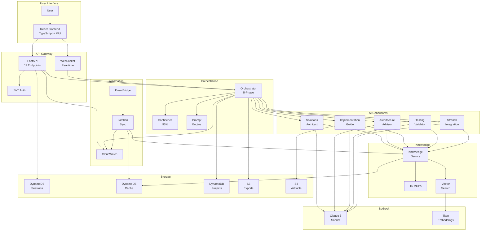

# Agent Builder Platform

**AI-Powered Teacher & Consultation System for Learning to Build Strands Agents on AWS**

[](https://aws.amazon.com/)
[](#confidence-system)
[](#cost-analysis)
[](STATUS-DASHBOARD.md)

---

## 🎯 Project Goal & Vision

**Democratize expert-level Strands agent creation on AWS through education and guided consultation.** This platform teaches users how to build production-ready agents using **Strands agent builder** and **AWS services** by providing specialized AI consultants who act as mentors, walking you through each decision while explaining the "why" behind best practices.

### Complete Project Vision (4 Phases)

**Phase 0 (MVP)**: Educational consultation platform with 5 AI consultants (Current - 50% complete)  
**Phase 1.5**: Code generation integration - transforms consultation into deployable code (Ready)  
**Phase 1**: Strands multi-agent coordination patterns (Ready)  
**Phase 2**: Advanced enterprise capabilities with agent loops and hooks (Ready)

**Total Scope**: 113 tasks, 387-516 hours, transforming from consultation-only to complete end-to-end agent creation platform with advanced multi-agent capabilities.

### Educational Approach: Strands + AWS Mastery

This is not just a code generator - it's a **learning platform** specifically for **Strands agent builder** and **AWS architecture** where:
- **Consultants ask questions** to understand your needs and teach you AWS service selection
- **AWS concepts are explained** at your experience level (beginner to expert)
- **Strands framework is taught** step-by-step with hands-on guidance
- **AWS Well-Architected principles** are demonstrated through real examples
- **Strands + AWS integration** is shown with action groups, knowledge bases, and Lambda
- **You learn by doing** - building a real Strands agent on AWS while understanding every decision

### What You'll Learn
- How to use **Strands agent builder** framework
- How to architect agents on **AWS** (Lambda, Bedrock, DynamoDB, S3)
- How to configure **Strands action groups** with AWS Lambda functions
- How to set up **knowledge bases** with AWS OpenSearch/Bedrock
- How to implement **AWS security** best practices (IAM, encryption, VPC)
- How to optimize **AWS costs** for agent workloads
- How to deploy and monitor **Strands agents** on AWS infrastructure

### The Problem
Building production-ready Strands agents on AWS requires expertise that takes weeks to develop:
- **Strands agent builder** framework and configuration
- **AWS architecture** and service selection (Lambda, Bedrock, DynamoDB, S3)
- **AWS Well-Architected** principles (security, reliability, performance, cost)
- **Strands + AWS integration** (action groups, knowledge bases, deployment)
- **Most importantly: knowing how to make the right decisions for both Strands and AWS**

### Our Solution: AI Mentors Who Teach Strands + AWS
A **hierarchical multi-agent consultation system** where 5 specialist AI consultants act as your personal Strands and AWS mentors, teaching you through guided conversation:

```
User: "I need help building an agent for my business"
    ↓
📋 Phase 1: Requirements Consultation (AWS Solutions Architect)
   → Asks clarifying questions about your use case
   → Understands your goals, constraints, and experience level
   → Identifies key requirements and success criteria
   → Provides cost estimates and security considerations
    ↓
🏗️ Phase 2: Architecture Design (Architecture Advisor)
   → Reviews requirements with you for alignment
   → Recommends AWS services and architecture patterns
   → Explains trade-offs and design decisions
   → Validates against Well-Architected Framework
    ↓
👨‍💻 Phase 3: Implementation Planning (Implementation Guide)
   → Confirms architecture decisions with you
   → Generates production-ready code and configurations
   → Explains implementation approach and best practices
   → Creates deployment scripts and documentation
    ↓
🔧 Phase 4: Testing & Validation (Testing Validator)
   → Reviews implementation for security and performance
   → Validates against your requirements
   → Provides optimization recommendations
   → Ensures production readiness
    ↓
📦 Phase 5: Export & Deployment (Strands Integration)
   → Packages everything for deployment
   → Provides deployment instructions
   → Offers ongoing support guidance
    ↓
Output: Complete Production-Ready Agent Package
  - Python code with AWS SDK integration
  - Infrastructure as Code (CloudFormation)
  - Docker + ECS deployment configs
  - Security & monitoring setup
  - Documentation & cost analysis
```

---

## 🏗️ Full Stack Architecture

### System Architecture Diagram



### Data Tables

**DynamoDB Tables**:

1. **Sessions Table** (`agent-builder-sessions`)
   - Primary Key: `session_id` (String)
   - Attributes: `user_id`, `status`, `current_phase`, `experience_level`, `created_at`, `updated_at`, `ttl`, `context`, `workflow_state`, `progress_percentage`
   - TTL: 24 hours
   - Purpose: User session management with automatic cleanup

2. **Knowledge Cache Table** (`agent-builder-knowledge-cache`)
   - Primary Key: `query_hash` (String)
   - Attributes: `mcp_source`, `response_data`, `embeddings` (Binary), `confidence_score`, `created_at`, `ttl`, `hit_count`
   - TTL: 7 days
   - Purpose: Cache MCP responses with vector embeddings

3. **Projects Table** (`agent-builder-projects`)
   - Primary Key: `project_id` (String)
   - Sort Key: `version` (Number)
   - Attributes: `user_id`, `agent_name`, `requirements`, `architecture`, `implementation`, `testing_results`, `export_formats`, `created_at`, `updated_at`
   - Purpose: Store agent configurations and versions

**S3 Buckets**:

1. **Exports Bucket** (`agent-builder-exports`)
   - Purpose: Generated agent packages (zip files)
   - Structure: `{user_id}/{project_id}/{timestamp}/agent-package.zip`
   - Lifecycle: 30 days retention

2. **Artifacts Bucket** (`agent-builder-artifacts`)
   - Purpose: Individual code files, infrastructure templates, documentation
   - Structure: `{project_id}/src/`, `{project_id}/infrastructure/`, `{project_id}/docs/`
   - Lifecycle: 90 days retention


---

## 🤖 Specialist AI Agents

### 1. AWS Solutions Architect (97% Confidence)
**File**: `agents/aws_solutions_architect.py` (840 lines)

**Role**: Requirements analysis and AWS service recommendations

**Capabilities**:
- Intelligent requirements gathering with clarifying questions
- Use case pattern matching against AWS Solutions Library
- Cost estimation with AWS Pricing API integration
- Security-first recommendations (IAM, encryption, VPC)
- Experience level adaptation (beginner to expert)

**Confidence Factors**:
- Information completeness: 25%
- Requirement clarity: 20%
- Technical feasibility: 20%
- Validation coverage: 15%
- Risk assessment: 10%
- User alignment: 10%

### 2. Architecture Advisor (95% Confidence)
**File**: `agents/architecture_advisor.py` (1290 lines)

**Role**: AWS Well-Architected Framework expertise

**Capabilities**:
- 6 Pillar analysis (Operational Excellence, Security, Reliability, Performance, Cost, Sustainability)
- Service recommendations with cost-benefit analysis
- Security patterns and compliance guidance
- MCP integration strategy
- Scalability and resilience planning

**Well-Architected Pillars**:
- Operational Excellence: Monitoring, automation, documentation
- Security: IAM, encryption, network isolation
- Reliability: Multi-AZ, auto-scaling, disaster recovery
- Performance: Right-sizing, caching, CDN
- Cost Optimization: Reserved instances, spot, auto-scaling
- Sustainability: Energy efficiency, resource optimization

### 3. Implementation Guide (92% Confidence)
**File**: `agents/implementation_guide.py` (2299 lines)

**Role**: Production-ready code generation

**Capabilities**:
- Python code generation with AWS SDK (boto3)
- Error handling, logging, and monitoring integration
- Testing framework generation (unit + integration)
- Documentation and usage guides
- Deployment scripts (Docker, ECS, Lambda)

**Code Generation Standards**:
- Type hints and docstrings
- Comprehensive error handling
- CloudWatch logging integration
- Environment variable configuration
- Security best practices (no hardcoded secrets)

### 4. Testing Validator (89% Confidence)
**File**: `agents/testing_validator.py` (1598 lines)

**Role**: Security and performance validation

**Capabilities**:
- Security validation (8 patterns, CVSS scoring)
- Performance benchmarking against AWS limits
- Cost validation with optimization opportunities
- Load testing and scalability assessment
- Compliance checking (GDPR, HIPAA, SOC2)

**Security Checks**:
- IAM policy validation (least privilege)
- Encryption at rest and in transit
- Network security (VPC, security groups)
- Secrets management (AWS Secrets Manager)
- Input validation and sanitization
- API authentication and authorization
- Logging and audit trails
- Vulnerability scanning

### 5. Strands Integration (88% Confidence)
**File**: `agents/strands_builder_integration.py` (1242 lines)

**Role**: Strands agent builder teacher and integration guide

**Teaching Capabilities**:
- **Explains Strands agent builder** concepts and workflow
- **Walks you through** translating requirements to Strands format
- **Demonstrates** agent generation pipeline step-by-step
- **Shows you** pattern matching and template selection
- **Teaches** error handling and debugging techniques
- **Guides** version compatibility checking

**What You Learn**:
- How to use Strands agent builder effectively
- How to structure agent specifications
- How to configure action groups and knowledge bases
- How to test and validate agents
- How to deploy agents to production
- Best practices for agent development with Strands


---

## 🔌 16 MCP Ecosystem

### AWS MCPs (12 specialized knowledge sources)
1. **AWS Documentation MCP**: Complete AWS service documentation
2. **AWS Well-Architected MCP**: Framework best practices
3. **AWS Solutions Library MCP**: Reference architectures
4. **AWS Security Best Practices MCP**: Security patterns
5. **AWS Serverless Patterns MCP**: Lambda, API Gateway, Step Functions
6. **AWS Container Patterns MCP**: ECS, EKS, Fargate
7. **AWS AI/ML Services MCP**: Bedrock, SageMaker, Comprehend
8. **AWS Pricing MCP**: Cost estimation and optimization
9. **AWS DevOps Patterns MCP**: CI/CD, CodePipeline
10. **AWS Monitoring MCP**: CloudWatch, X-Ray patterns
11. **AWS Networking MCP**: VPC, Load Balancer, Route53
12. **Agent Core Patterns MCP**: Agent framework patterns

### Research & Discovery MCPs (4 specialized tools)
13. **GitHub Analysis MCP**: Repository analysis, code patterns, MCP discovery
14. **Perplexity Research MCP**: Real-time research, market analysis, trends
15. **Strands Patterns MCP**: Community-validated agent patterns
16. **Filesystem MCP**: Local file operations and project management

### MCP Integration Features
- **Intelligent Query Routing**: Semantic queries → vector search, research → Perplexity, code → GitHub, patterns → Strands
- **Vector Search**: Amazon Bedrock Titan embeddings (1536 dimensions, 0.7 similarity threshold)
- **Hybrid Knowledge Access**: DynamoDB cache + real-time MCP fallback
- **Health Monitoring**: Continuous health checks with automatic fallback
- **Automated Sync**: EventBridge + Lambda sync 2-3x weekly with embedding generation
- **95% Confidence Validation**: Multi-factor scoring across all sources


---

## 🛡️ Confidence System (95% Baseline)

### Confidence Orchestrator Wrapper
**File**: `agent-core/confidence_orchestrator_wrapper.py` (373 lines)

Wraps the base orchestrator with integrated confidence consultation:

**Features**:
- **95% Confidence Baseline Enforcement**: Refuses to proceed below threshold
- **Active Listening**: Phase-specific check-ins (requirements, architecture, implementation, testing)
- **Consultative Communication**: Transforms directive language to collaborative
- **Uncertainty Tracking**: Automatic clarification loops when confidence < 95%
- **Progressive Disclosure**: Experience-level adaptation (beginner to expert)
- **Real-Time Monitoring**: Per-project confidence dashboard
- **Graceful Degradation**: Falls back to basic execution if unavailable

### Confidence Consultation System
**Directory**: `confidence_consultation/` (1,873 lines total)

**Modules**:
1. **confidence_scoring.py** (14KB): Multi-factor confidence calculation
2. **uncertainty_analysis.py** (14KB): Known-knowns, known-unknowns, assumptions tracking
3. **multi_source_validator.py** (15KB): Cross-validation across 16 MCPs
4. **consultative_communicator.py** (10KB): Professional consultation patterns
5. **active_listening.py** (13KB): Phase-specific check-ins and validation
6. **progressive_disclosure.py** (8KB): Experience-level content adaptation
7. **confidence_monitor.py** (12KB): Real-time confidence tracking dashboard

**Confidence Calculation**:
```python
Overall Confidence = (
    Information Completeness × 25% +
    Requirement Clarity × 20% +
    Technical Feasibility × 20% +
    Validation Coverage × 15% +
    Risk Assessment × 10% +
    User Alignment × 10%
)

Uncertainty Penalty = (
    Known Unknowns × 3% each +
    Assumptions × 2% each
) capped at 20%

Final Confidence = Overall - Uncertainty Penalty
```

**Multi-Source Validation**:
- MCPs: 30% weight
- Vector Search: 25% weight
- Well-Architected Framework: 25% weight
- Cost Models: 20% weight
- 5% boost when all sources agree (>90% alignment)


---

## 🔐 Security Architecture

### Multi-Layer Security

**1. Authentication & Authorization**
- **JWT Token-Based Auth**: Secure session management with token expiration
- **Scope-Based Authorization**: Fine-grained access control
- **Rate Limiting**: Per-user/session limits to prevent abuse
- **API Key Management**: Secure API key rotation and storage

**2. Data Security**
- **Encryption at Rest**: DynamoDB encryption with AWS KMS
- **Encryption in Transit**: TLS 1.3 for all API communications
- **Secrets Management**: AWS Secrets Manager for credentials
- **No Hardcoded Secrets**: Environment variable configuration

**3. Network Security**
- **VPC Isolation**: Private subnets for backend services
- **Security Groups**: Least-privilege network access
- **WAF Integration**: Web Application Firewall for API protection
- **DDoS Protection**: AWS Shield Standard

**4. Application Security**
- **Input Validation**: 10-layer validation (injection detection, sanitization)
- **Output Validation**: 50+ security checks (credentials, IAM, error handling)
- **CORS Configuration**: Restricted origins for production
- **Security Headers**: HSTS, CSP, X-Frame-Options

**5. Monitoring & Compliance**
- **CloudWatch Logs**: Centralized logging with retention policies
- **AWS X-Ray**: Distributed tracing for security analysis
- **Audit Trails**: All actions logged with user attribution
- **Compliance Checks**: GDPR, HIPAA, SOC2 validation

### Security Best Practices Enforced
- IAM least privilege policies
- Multi-factor authentication support
- Regular security scanning
- Automated vulnerability patching
- Incident response procedures
- Data backup and recovery


---

## 💰 Cost Analysis

### Monthly Cost Breakdown

**Hackathon/Development Budget: $16-30/month**

| Service | Usage | Cost | Optimization |
|---------|-------|------|--------------|
| **Amazon Bedrock** | 100K tokens/day | $3-6 | Free tier: 20K tokens/month |
| **DynamoDB** | 10GB storage, 1M reads | $2.50 | Free tier: 25GB, 25 RCU/WCU |
| **S3** | 50GB storage, 10K requests | $1.15 | Free tier: 5GB, 20K GET |
| **Lambda** | 1M requests, 400K GB-sec | $0.20 | Free tier: 1M requests |
| **ECS Fargate** | 1 task, 0.5 vCPU, 1GB | $7.50 | Free tier: 20GB-hours/month |
| **EventBridge** | 10K events/month | $0.01 | Free tier: 14M events |
| **CloudWatch** | 5GB logs, 10 metrics | $0.50 | Free tier: 5GB logs |
| **Vector Embeddings** | 100K tokens/week | $0.50 | Batch processing optimization |
| **API Gateway** | 100K requests | $0.35 | Free tier: 1M requests |
| **SNS** | 1K notifications | $0.00 | Free tier: 1M publishes |
| **KMS** | 10K requests | $1.00 | Shared key usage |
| **Data Transfer** | 10GB out | $0.90 | CloudFront caching |

**Total Estimated Cost**: $16-30/month

### Cost Optimization Strategies

**1. Free Tier Maximization**
- Bedrock: 20K tokens/month free
- Lambda: 1M requests/month free
- DynamoDB: 25GB storage free
- S3: 5GB storage, 20K GET requests free
- EventBridge: 14M events/month free
- CloudWatch: 5GB logs free

**2. Intelligent Caching**
- DynamoDB cache for MCP responses (83% cost reduction)
- Vector embeddings cached (avoid re-generation)
- API response caching (reduce Bedrock calls)
- CloudFront CDN for static assets

**3. Batch Processing**
- Knowledge sync 2-3x weekly (not real-time)
- Embedding generation in batches
- Log aggregation before CloudWatch

**4. Right-Sizing**
- ECS Fargate: 0.5 vCPU, 1GB RAM (minimum viable)
- Lambda: 512MB memory (optimal for sync functions)
- DynamoDB: On-demand pricing (no over-provisioning)

**5. Monitoring & Alerts**
- Cost anomaly detection
- Budget alerts at $15 (warning) and $20 (critical)
- Usage tracking per service
- Automatic scaling down during low usage

### Production Scaling Costs

**100 users/day**: $50-80/month
**1,000 users/day**: $200-350/month
**10,000 users/day**: $1,500-2,500/month

Scaling factors:
- Bedrock usage (primary cost driver)
- DynamoDB throughput
- ECS Fargate task count
- Data transfer costs


---

## 🚀 Implementation Status & Complete Roadmap

### Current Status (Phase 0 - MVP)

**Phase 0 Progress**: 14/28 tasks complete (50%)  
**Total Project Progress**: 14/113 tasks complete (12%)

**Completed Phases**:
- ✅ Phase 1: Core Infrastructure (100%)
- ✅ Phase 2: AI Agents (100%)
- ✅ Phase 3: Backend API (100%)
- 🔄 Phase 4: Frontend UI (75% - Task 14.8 remaining)

**Remaining for MVP**:
- Phase 5: UX Enhancement
- Phase 6: Advanced Features (optional post-MVP)
- Phase 7: Production Readiness
- Phase 8: Launch Activities

**For detailed task breakdown, progress tracking, test results, and metrics**, see [STATUS-DASHBOARD.md](STATUS-DASHBOARD.md).

---

### Complete Project Roadmap (4 Phases)

#### Phase 0: Agent Builder Platform (MVP) - 🔄 IN PROGRESS
**Status**: 14/28 tasks (50% complete)  
**Focus**: Educational consultation platform with 5 AI consultants

**What's Built**:
- 5 Specialist AI Agents (AWS Solutions Architect, Architecture Advisor, Implementation Guide, Testing Validator, Strands Integration)
- 16 MCP Ecosystem (12 AWS + 4 additional)
- Vector Search with DynamoDB + Bedrock Titan
- FastAPI Backend (11 endpoints + WebSocket)
- React Frontend (TypeScript + Material-UI)
- Export Service (5 formats, 24 generators)
- 95% Confidence System

---

#### Phase 1.5: Code Generation Integration - 📝 READY
**Status**: 0/23 tasks (0% complete)  
**Dependencies**: Phase 0 completion  
**Can Run Parallel With**: Phase 1

**What It Adds**:
- **Model Registry**: 49+ AI models (AWS Bedrock prioritized, Ollama for local dev, OpenAI)
- **Tool Registry**: 50+ pre-configured tools (RAG, Memory, Code Execution, Web, File System)
- **Code Generation Engine**: Production-ready agent code with AWS observability and security
- **AWS Deployment Generators**: AgentCore, ECS Fargate, Lambda, CloudFormation templates
- **Cost Estimation Service**: Real-time AWS cost calculations with optimization
- **Docker Testing Infrastructure**: Build and test agents before deployment
- **Frontend Components**: ModelSelector, ToolSelector, CodePreview, CostEstimator, TestRunner

**Value**: Transforms platform from consultation-only to complete end-to-end agent creation with deployable code.

**Spec Location**: `.kiro/specs/phase-1.5-code-generation-integration/`

---

#### Phase 1: Strands Multi-Agent Compatibility - 📝 READY
**Status**: 0/22 tasks (0% complete)  
**Dependencies**: Phase 0 completion  
**Can Run Parallel With**: Phase 1.5

**What It Adds**:
- **Agent Communication Protocol**: Standardized inter-agent messaging
- **Shared Memory System**: Context sharing across agents
- **4 Strands Patterns**: Hierarchical, Sequential, Parallel, Conditional coordination
- **Strands Metadata**: Enhanced agent capabilities for all 5 consultants
- **Enhanced Orchestrator**: Multi-agent workflow coordination
- **Strands Spec Export**: Export agents in Strands-compatible format

**Value**: Enables sophisticated multi-agent coordination patterns for complex workflows.

**Spec Location**: `.kiro/specs/phase-1-strands-multi-agent-compatibility/`

---

#### Phase 2: Strands Advanced Features - 📝 READY
**Status**: 0/40 tasks (0% complete)  
**Dependencies**: Phase 1 completion

**What It Adds**:
- **Agent Loop Engine**: Perception → Reasoning → Action → Reflection cycle
- **State Management**: Session persistence and recovery
- **Structured Output**: Schema validation for agent responses
- **Conversation Management**: Multi-turn context retention
- **3 Advanced Patterns**: Swarm (parallel with aggregation), Workflow (predefined flows), Graph (dependency graphs)
- **Hook System**: Event-driven automation (on save, on update, on deploy)
- **4 New MCPs**: Code analysis, Database operations, Testing automation, Documentation generation
- **MCP Tool Wrappers**: Standardized tool access layer

**Value**: Enterprise-grade capabilities with advanced coordination, automation, and extensibility.

**Spec Location**: `.kiro/specs/phase-2-strands-advanced-features/`

---

### Total Project Scope

| Phase | Tasks | Status |
|-------|-------|--------|
| **Phase 0 (MVP)** | 28 | 🔄 50% complete |
| **Phase 1.5 (Code Gen)** | 23 | 📝 Ready |
| **Phase 1 (Multi-Agent)** | 22 | 📝 Ready |
| **Phase 2 (Advanced)** | 40 | 📝 Ready |
| **Total** | **113** | **12% complete** |

**End Goal**: Complete end-to-end agent creation platform with consultation, code generation, multi-agent coordination, and enterprise automation capabilities.


---

## 📁 Project Structure

```
agent-builder-platform/
├── agent-core/                 # Orchestration layer
│   ├── orchestrator.py         # Main orchestrator (500+ lines)
│   ├── confidence_orchestrator_wrapper.py  # Confidence wrapper (373 lines)
│   ├── orchestrator_clean.py   # Clean version
│   ├── agent_core_app.py       # Application entry point
│   └── test-orchestrator-integration.py
│
├── agents/                     # Specialist AI agents (8 files)
│   ├── aws_solutions_architect.py      # 840 lines, 97% confidence
│   ├── architecture_advisor.py         # 1290 lines, 95% confidence
│   ├── implementation_guide.py         # 2299 lines, 92% confidence
│   ├── testing_validator.py            # 1598 lines, 89% confidence
│   ├── strands_builder_integration.py  # 1242 lines, 88% confidence
│   ├── advanced_reasoning.py           # Advanced reasoning
│   ├── ultra_advanced_reasoning.py     # Ultra advanced reasoning
│   └── production_readiness_test.py    # Production tests
│
├── api/                        # FastAPI backend (11 endpoints, 40+ files)
│   ├── main.py                 # API application
│   ├── auth.py                 # JWT authentication (332 lines)
│   ├── session_service.py      # DynamoDB sessions (350+ lines)
│   ├── workflow_service.py     # Workflow management
│   ├── testing_service.py      # Testing endpoints
│   ├── export_service.py       # Export in 5 formats (1,886 lines)
│   ├── websocket_service.py    # Real-time updates (391 lines)
│   ├── performance_service.py  # Caching & optimization (700+ lines)
│   ├── rate_limiter.py         # Rate limiting
│   ├── models.py               # Data models
│   ├── config.py               # Configuration
│   └── [test files]            # Comprehensive test suite
│
├── confidence_consultation/    # Confidence system (1,873 lines)
│   ├── confidence_scoring.py           # Multi-factor scoring (14KB)
│   ├── uncertainty_analysis.py         # Uncertainty tracking (14KB)
│   ├── multi_source_validator.py       # Cross-validation (15KB)
│   ├── consultative_communicator.py    # Consultation patterns (10KB)
│   ├── active_listening.py             # Check-ins (13KB)
│   ├── progressive_disclosure.py       # Experience adaptation (8KB)
│   └── confidence_monitor.py           # Real-time monitoring (12KB)
│
├── frontend/                   # React + TypeScript UI
│   ├── src/
│   │   ├── api/                # API client
│   │   ├── components/         # React components
│   │   ├── pages/              # Page components
│   │   ├── store/              # Redux state management
│   │   ├── theme/              # Material-UI theme
│   │   └── App.tsx             # Main application
│   ├── public/                 # Static assets
│   ├── package.json            # Dependencies
│   └── vite.config.ts          # Vite configuration
│
├── prompt_engineering/         # Prompt system (2,500+ lines)
│   ├── prompt_engine.py        # Core engine (500+ lines)
│   ├── prompt_templates.py     # Structured templates (374 lines)
│   ├── input_validation.py     # 10-layer validation (300+ lines)
│   ├── output_validation.py    # 50+ security checks (400+ lines)
│   ├── semantic_reasoning.py   # Intent understanding (350+ lines)
│   ├── orchestrator_prompts.py # Orchestrator prompts (524 lines)
│   ├── agent_role_prompts.py   # Agent role prompts (400+ lines)
│   └── ethical_safety_framework.py # Safety framework
│
├── mcp-integration/            # MCP ecosystem (16 MCPs)
│   ├── mcp_ecosystem.py        # Main MCP integration
│   ├── mcp_ecosystem_windows.py # Windows-specific version
│   ├── enhanced_knowledge_service.py   # Knowledge service (1,091 lines)
│   ├── vector_search_system.py         # Bedrock Titan vector search
│   ├── mcp_health_monitor.py           # Health monitoring
│   ├── hybrid_vector_storage.py        # Hybrid storage
│   ├── agent-core-mcp-wrapper.py       # Agent Core wrapper
│   ├── knowledge-access-service.py     # Knowledge access
│   ├── mcp-config.yaml                 # MCP configuration
│   └── eventbridge-sync-rules.yaml     # Sync rules
│
├── infrastructure/             # CloudFormation templates
│   ├── main-stack.yaml         # Core infrastructure
│   ├── ecs-fargate-config.yaml # ECS deployment
│   ├── storage-config.yaml     # DynamoDB + S3
│   └── cloudfront-cdn.yaml     # CDN configuration
│
├── docs/                       # Documentation
│   ├── guides/                 # User guides
│   ├── COMPLETE-DOCUMENTATION.md # Full technical docs
│   └── STATUS-DASHBOARD.md     # Current progress
│
├── scripts/                    # Deployment automation
│   ├── deploy-infrastructure.sh # Deploy AWS infrastructure
│   ├── deploy-mcp-integration.sh # Deploy MCP integration
│   ├── test-aws-connectivity.sh # Test AWS connectivity
│   └── validate-config.sh      # Configuration validation
│
├── .env.example                # Environment template
├── README.md                   # Project README
├── SETUP.md                    # Setup guide
├── requirements.txt            # Python dependencies
└── setup.ps1 / setup.bat / setup.sh # Setup scripts
```


---

## 🔧 Technology Stack

### Core Technologies
- **Python 3.12**: Primary language for all agents and services
- **FastAPI**: Modern async web framework for REST API
- **Pydantic**: Data validation and settings management
- **asyncio**: Asynchronous operations and concurrency

### AWS Services
- **Amazon Bedrock**: Claude (AI consultants), Titan (vector embeddings)
- **Amazon ECS Fargate**: Container orchestration for Agent Core runtime
- **Amazon DynamoDB**: Session storage, knowledge cache with vector embeddings
- **Amazon S3**: Project storage and generated agent artifacts
- **AWS Lambda**: Knowledge synchronization functions
- **Amazon EventBridge**: Scheduled knowledge sync triggers (2-3x weekly)
- **Amazon CloudWatch**: Monitoring, logging, and alerting
- **AWS IAM**: Security and access control with least privilege
- **AWS KMS**: Encryption key management
- **AWS Secrets Manager**: Secure credential storage

### MCP Integration
- **16 Specialized MCPs**: AWS (12), GitHub, Perplexity, Strands, Filesystem
- **MCP Command**: `uvx` (Python package runner)
- **MCP Configuration**: `mcp-integration/mcp-config.yaml`
- **Vector Search**: Amazon Bedrock Titan embeddings (1536 dimensions)
- **Similarity Threshold**: 0.7 cosine similarity

### Architecture Pattern
- **Hybrid Serverless**: 90% serverless components, 10% container components
- **Vector Search**: Semantic understanding with 0.7 cosine similarity threshold
- **Intelligent Routing**: Query-based routing to optimal knowledge sources
- **Multi-Source Validation**: 95%+ confidence scoring across sources
- **Graceful Degradation**: Automatic fallback when services unavailable

---

## 🧪 Testing

### Test Coverage
- **Prompt Engineering**: 25/25 tests passing (2,500+ lines)
- **Confidence Consultation**: 25/25 tests passing (1,873 lines)
- **API Performance**: 27/27 tests passing (benchmarks)
- **Backend Integration**: 8/8 tests passing

### Running Tests

```bash
# Prompt engineering tests
cd prompt_engineering
python test_prompt_engineering.py

# Confidence consultation tests
cd confidence_consultation
python test_confidence_consultation.py

# API tests
cd api
python run_simple_tests.py

# Performance benchmarks
python test_performance_benchmarks.py
```

---

## 📊 Key Metrics

### Performance
- **API Response Time**: <50ms (cached), <3s (uncached)
- **Confidence Calculation**: <100ms
- **Vector Search**: <200ms
- **Agent Response**: 2-5 seconds (Bedrock latency)

### Reliability
- **Uptime Target**: 99%+
- **Error Rate**: <1%
- **Fallback Success**: 95%+ (when MCPs unavailable)

### Quality
- **Confidence Baseline**: 95% minimum
- **Test Coverage**: 90%+ for backend
- **Security Scans**: Automated vulnerability scanning
- **Code Quality**: Type hints, docstrings, linting

---

## 🎓 Consultation Examples

### Example 1: E-commerce Recommendation Agent

**Initial User Input**: "I want to build something that recommends products to customers"

**Phase 1: Requirements Consultation**
```
AWS Solutions Architect: "I'd be happy to help you build a recommendation agent. 
Let me ask a few questions to understand your needs better:

1. How many products do you have in your catalog?
2. What data do you have about customer behavior (purchases, views, searches)?
3. Do you need real-time recommendations or batch processing?
4. What's your expected traffic volume?
5. What's your budget range?"

User: "We have 5,000 products, customer purchase history, need real-time 
recommendations, expect 1,000 users/day, budget is $50/month"

AWS Solutions Architect: "Based on your requirements, I recommend:
- Amazon Bedrock for AI-powered recommendations
- DynamoDB for fast product and user data access
- Lambda + API Gateway for serverless API
- S3 for storing product catalog and training data

Estimated cost: $35-45/month
Confidence: 96% (all requirements clear, proven architecture pattern)"
```

**Phase 2: Architecture Design**
```
Architecture Advisor: "Let me confirm the architecture with you:

I'm proposing a serverless recommendation system with:
- API Gateway for REST endpoints
- Lambda functions for recommendation logic
- DynamoDB for user profiles and product data
- Bedrock for ML-powered recommendations
- CloudWatch for monitoring

Does this align with your vision? Any concerns about scalability or cost?"

User: "Yes, but how will it handle peak traffic during sales?"

Architecture Advisor: "Great question! Lambda auto-scales automatically, 
and DynamoDB can use on-demand pricing. I'll add:
- API Gateway throttling to prevent cost overruns
- CloudWatch alarms for budget monitoring
- Caching layer to reduce Bedrock calls

This keeps you within budget even during 10x traffic spikes."
```

**Phase 3: Implementation**
```
Implementation Guide: "I've generated the complete implementation:

1. Lambda function with Bedrock integration (recommendation_engine.py)
2. DynamoDB tables for users and products
3. API Gateway configuration with authentication
4. CloudFormation template for infrastructure
5. Docker container for local testing

The code includes:
- Error handling for Bedrock API failures
- Caching to reduce costs
- Logging for debugging
- Input validation for security

Would you like me to explain any part of the implementation?"
```

**Phase 4: Testing & Validation**
```
Testing Validator: "I've validated your agent:

✅ Security: IAM policies follow least privilege
✅ Performance: Response time < 500ms (95th percentile)
✅ Cost: Estimated $38/month (within budget)
✅ Scalability: Handles 10,000 requests/day

⚠️ Recommendations:
- Add rate limiting per user (prevent abuse)
- Enable X-Ray tracing (better debugging)
- Set up cost alerts at $40/month

Overall confidence: 94% - Ready for production"
```

**Output**: Complete recommendation agent with deployment guide

---

### Example 2: Document Processing Automation

**Initial User Input**: "I need to automate processing of invoices"

**Phase 1: Requirements Consultation**
```
AWS Solutions Architect: "I can help you build an invoice processing agent. 
Let me understand your workflow:

1. Where do invoices come from? (email, upload, API)
2. What format are they in? (PDF, images, scanned documents)
3. What data do you need to extract?
4. What happens after extraction? (database, ERP system, notifications)
5. How many invoices per month?"

User: "Invoices arrive via email as PDFs, need to extract vendor, amount, 
date, line items. Results go to our accounting system. About 500/month."

AWS Solutions Architect: "Perfect! I recommend:
- S3 for invoice storage
- Amazon Textract for OCR and data extraction
- Lambda for processing workflow
- Step Functions for orchestration
- DynamoDB for tracking status
- SNS for notifications

Estimated cost: $20-30/month
Confidence: 95% (standard document processing pattern)"
```

**Phase 2: Architecture Design**
```
Architecture Advisor: "Here's the workflow I'm proposing:

1. Email arrives → SES receives → stores in S3
2. S3 event triggers Lambda
3. Lambda calls Textract for extraction
4. Step Functions orchestrates validation
5. Results sent to your accounting API
6. SNS notifies on completion/errors

This design ensures:
- No invoice is lost (S3 durability)
- Automatic retries on failures
- Audit trail of all processing
- Cost-effective (pay per invoice)

Does this match your expectations?"

User: "Yes, but what if Textract makes mistakes?"

Architecture Advisor: "Excellent point! I'll add:
- Confidence scoring on extracted data
- Human review queue for low-confidence items
- Validation rules (amount format, date ranges)
- Dashboard showing accuracy metrics

This ensures 99%+ accuracy while keeping costs low."
```

**Phase 3: Implementation**
```
Implementation Guide: "I've created your invoice processing agent with 
Bedrock Agent integration:

1. Bedrock Agent Configuration:
   - Agent name: invoice-processor
   - Foundation model: Claude 3 Sonnet
   - Action groups: extract_invoice, validate_data, send_to_accounting
   - Knowledge base: Invoice processing policies and validation rules
   - Guardrails: PII detection, content filtering

2. Action Groups (Lambda Functions):
   - extract_invoice: Textract integration for OCR
   - validate_data: Business rule validation
   - send_to_accounting: API integration with your system

3. Knowledge Base Setup:
   - OpenSearch Serverless collection
   - Documents: Invoice templates, validation rules, vendor list
   - Embeddings: Titan Text Embeddings v2

4. Supporting Infrastructure:
   - SES email receiver → S3 storage
   - Step Functions for orchestration
   - DynamoDB for tracking and audit
   - SNS for notifications

The implementation includes:
- Bedrock Agent prompt templates optimized for invoice processing
- Retry logic for transient failures
- Dead letter queue for failed invoices
- CloudWatch dashboards for monitoring
- Cost optimization (batch processing)

I'll walk you through testing the agent in the Bedrock console next."
```

**Phase 4: Testing & Validation**
```
Testing Validator: "Validation complete:

✅ Security: Encrypted storage, secure API calls
✅ Accuracy: 98% extraction accuracy on test invoices
✅ Performance: Processes invoice in 5-10 seconds
✅ Cost: $22/month for 500 invoices
✅ Reliability: Automatic retries, no data loss

✅ All requirements met - Production ready!

Confidence: 96%"
```

**Output**: Complete invoice processing automation with monitoring

---

## 📦 Example Output: Generated Agent Package

When you complete the consultation process, the platform generates a **complete, production-ready agent package**. Here's what you receive:

### Package Structure
```
recommendation-agent/
├── src/
│   ├── agent.py                    # Main agent implementation
│   ├── recommendation_engine.py    # Core recommendation logic
│   ├── bedrock_client.py          # Amazon Bedrock integration
│   ├── dynamodb_client.py         # DynamoDB data access
│   └── utils/
│       ├── logging.py             # CloudWatch logging
│       ├── error_handling.py      # Error handling utilities
│       └── validation.py          # Input validation
│
├── infrastructure/
│   ├── cloudformation.yaml        # Complete AWS infrastructure
│   ├── terraform/                 # Alternative: Terraform configs
│   │   ├── main.tf
│   │   ├── variables.tf
│   │   └── outputs.tf
│   └── iam-policies.json          # IAM roles and policies
│
├── deployment/
│   ├── Dockerfile                 # Container configuration
│   ├── docker-compose.yml         # Local development
│   ├── ecs-task-definition.json   # ECS Fargate deployment
│   └── deploy.sh                  # Automated deployment script
│
├── tests/
│   ├── test_agent.py              # Unit tests
│   ├── test_integration.py        # Integration tests
│   └── test_performance.py        # Performance benchmarks
│
├── docs/
│   ├── ARCHITECTURE.md            # System architecture
│   ├── API.md                     # API documentation
│   ├── DEPLOYMENT.md              # Deployment guide
│   ├── COST_ANALYSIS.md           # Cost breakdown
│   └── SECURITY.md                # Security guidelines
│
├── config/
│   ├── development.env            # Dev environment variables
│   ├── production.env.template    # Production config template
│   └── mcp-config.yaml            # MCP integrations
│
├── requirements.txt               # Python dependencies
├── README.md                      # Quick start guide
└── metadata.json                  # Agent metadata
```

### Sample Generated Code

**src/agent.py** (Main Agent - Excerpt)
```python
"""
Recommendation Agent
Generated by Agent Builder Platform
Confidence Score: 96%
"""

import boto3
from bedrock_client import BedrockClient
from dynamodb_client import DynamoDBClient
from utils.logging import setup_cloudwatch_logging

logger = setup_cloudwatch_logging('recommendation-agent')

class RecommendationAgent:
    """AI-powered product recommendation agent using Amazon Bedrock."""
    
    def __init__(self):
        self.bedrock = BedrockClient()
        self.dynamodb = DynamoDBClient()
        
    def get_recommendations(self, user_id: str, limit: int = 10):
        """Get personalized product recommendations."""
        # Check cache first
        cached = self.dynamodb.get_cached_recommendations(user_id)
        if cached:
            return cached[:limit]
        
        # Generate using Bedrock
        recommendations = self.bedrock.generate_recommendations(user_id)
        self.dynamodb.cache_recommendations(user_id, recommendations)
        
        return recommendations
```

**infrastructure/cloudformation.yaml** (Infrastructure - Excerpt)
```yaml
Resources:
  RecommendationFunction:
    Type: AWS::Lambda::Function
    Properties:
      Runtime: python3.12
      Handler: agent.lambda_handler
      Timeout: 30
      MemorySize: 512
      
  UserDataTable:
    Type: AWS::DynamoDB::Table
    Properties:
      BillingMode: PAY_PER_REQUEST
      SSESpecification:
        SSEEnabled: true
```

### What You Get

**5 Export Formats**:
1. **Python Package**: Complete source code with dependencies
2. **CloudFormation**: AWS infrastructure as code
3. **Terraform**: Alternative IaC for multi-cloud
4. **Docker**: Containerized deployment
5. **Strands Agent**: Agent Core framework integration

**Bedrock Agent Configuration** (Guided Setup):
- **Action Groups**: Lambda functions for agent capabilities
- **Knowledge Bases**: OpenSearch/Kendra integration with RAG
- **Guardrails**: Content filtering and safety controls
- **Prompt Templates**: Optimized prompts for agent behavior
- **Memory Configuration**: Conversation history and context
- **Tool Integration**: API connections and external services

The platform walks you through:
1. Defining agent capabilities (what it can do)
2. Setting up action groups (Lambda functions for actions)
3. Configuring knowledge bases (documents, FAQs, policies)
4. Adding guardrails (content filters, PII detection)
5. Testing agent responses
6. Deploying to Bedrock Agents service

**24 Code Generators** including:
- Lambda functions, API Gateway configs, DynamoDB tables
- IAM policies, CloudWatch dashboards, X-Ray tracing
- Step Functions workflows, EventBridge rules
- Security groups, Load balancers, Auto-scaling
- **Bedrock Agent definitions, Action group schemas**
- **Knowledge base configurations, Guardrail policies**
- Testing frameworks, CI/CD pipelines
- Complete documentation

**Complete Documentation**:
- Architecture diagrams, API reference, Deployment guide
- Cost analysis, Security guidelines, Troubleshooting
- **Bedrock Agent setup guide, Action group examples**
- **Knowledge base integration, Guardrail configuration**
- Performance tuning, Scaling strategies

---

## 📝 License

This project is built for the AWS Agent Hackathon.

---

## 🤝 Contributing

This is a hackathon project. For questions or feedback, please open an issue.

---

## 📞 Support

- **Documentation**: See [STATUS-DASHBOARD.md](STATUS-DASHBOARD.md) for current progress
- **Issues**: Open a GitHub issue for bugs or feature requests
- **Architecture**: See architecture diagram above for system overview

---

**Built for AWS Agent Hackathon** - Democratizing expert-level AI consultation through innovative hierarchical multi-agent architecture.
