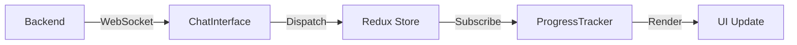

# Progress Tracker Component - Visual Guide

## Component Preview

```
┌─────────────────────────────────────────────┐
│  Agent Creation Progress                    │
│  Building your production-ready agent       │
├─────────────────────────────────────────────┤
│                                             │
│  Overall Progress              45%          │
│  ████████████░░░░░░░░░░░░░░░░              │
│                                             │
├─────────────────────────────────────────────┤
│                                             │
│  Elapsed Time    │  Est. Remaining          │
│     12:34        │     ~32 min              │
│  ─────────────────────────────────────      │
│       Target: 30-45 minutes                 │
│                                             │
├─────────────────────────────────────────────┤
│  Workflow Phases                            │
│                                             │
│  ✓ 1. Requirements          [COMPLETED]    │
│     Understanding your needs                │
│     Est. 8 minutes                          │
│                                             │
│  ✓ 2. Architecture          [COMPLETED]    │
│     Designing the solution                  │
│     Est. 10 minutes                         │
│                                             │
│ ┃● 3. Implementation        [IN PROGRESS]  │
│ ┃  Building your agent                     │
│ ┃  Est. 15 minutes                         │
│                                             │
│  ○ 4. Testing               [PENDING]      │
│     Validating functionality                │
│     Est. 7 minutes                          │
│                                             │
│  ○ 5. Deployment            [PENDING]      │
│     Preparing for production                │
│     Est. 5 minutes                          │
│                                             │
├─────────────────────────────────────────────┤
│         Phase 3 of 5                        │
└─────────────────────────────────────────────┘
```

## Key Features

### 1. Overall Progress Bar
- **Visual**: Animated gradient progress bar
- **Color**: Blue gradient (#1976d2 → #42a5f5)
- **Updates**: Real-time as phases complete
- **Calculation**: (Completed Phases / Total Phases) × 100

### 2. Time Tracking
- **Elapsed Time**: Live counter (MM:SS format)
- **Remaining Time**: Dynamic calculation
- **Target Range**: 30-45 minutes displayed
- **Updates**: Every second via setInterval

### 3. Phase Status Icons
```
✓ Completed   → Green checkmark (CheckCircle)
● In Progress → Blue filled circle (Circle)
○ Pending     → Gray outline circle (RadioButtonUnchecked)
```

### 4. Active Phase Highlighting
When a phase is active:
- **Border**: 2px primary blue border
- **Background**: Light blue tint (primary.50)
- **Scale**: 1.02x transform
- **Shadow**: Elevation level 2
- **Accent**: 4px left border indicator
- **Animation**: 0.3s ease-in-out transition

### 5. Phase Information
Each phase card shows:
- Phase number (1-5)
- Phase name
- Status chip (color-coded)
- Description text
- Estimated duration

## State Flow



## WebSocket Messages

### Phase Change
```json
{
  "type": "phase_change",
  "phase": "architecture",
  "message": "Moving to architecture design"
}
```

### Phase Completion
```json
{
  "type": "workflow_update",
  "completed_phase": "requirements",
  "phase": "architecture",
  "progress": 20
}
```

### Progress Update
```json
{
  "type": "progress_update",
  "progress": 45
}
```

## Redux Actions

```typescript
// Set current active phase
dispatch(setPhase('architecture'))

// Mark phase as completed
dispatch(completePhase('requirements'))

// Update overall progress
dispatch(setProgress(45))

// Update elapsed time (called every second)
dispatch(updateElapsedTime(754)) // seconds
```

## Responsive Design

### Desktop (md+)
- Right sidebar: 4/12 columns
- Full height with scroll
- All features visible

### Mobile (xs-sm)
- Full width: 12/12 columns
- Stacked below chat
- Compact layout

## Animation Details

### Progress Bar
- **Type**: Determinate linear progress
- **Height**: 8px
- **Border Radius**: 4px
- **Gradient**: Linear gradient animation
- **Transition**: Smooth value changes

### Phase Cards
- **Transform**: scale(1) → scale(1.02)
- **Border**: 1px → 2px
- **Background**: white → primary.50
- **Shadow**: 0 → elevation 2
- **Duration**: 300ms
- **Easing**: ease-in-out

### Time Counter
- **Update Frequency**: 1000ms (1 second)
- **Format**: MM:SS (e.g., "12:34")
- **Color**: Primary blue for elapsed, grey for remaining

## Color Palette

```css
/* Status Colors */
--completed: #2e7d32 (success.main)
--in-progress: #1976d2 (primary.main)
--pending: #9e9e9e (grey.400)

/* Progress Bar */
--gradient-start: #1976d2
--gradient-end: #42a5f5

/* Backgrounds */
--active-bg: rgba(25, 118, 210, 0.04) (primary.50)
--card-bg: #ffffff (background.paper)

/* Borders */
--active-border: #1976d2 (primary.main)
--default-border: rgba(0, 0, 0, 0.12) (divider)
```

## Usage Example

```tsx
import ProgressTracker from '../components/ProgressTracker'

function AgentBuilderPage() {
  return (
    <Grid container spacing={2}>
      <Grid item xs={12} md={8}>
        <ChatInterface />
      </Grid>
      <Grid item xs={12} md={4}>
        <Paper sx={{ height: '100%', p: 2 }}>
          <ProgressTracker />
        </Paper>
      </Grid>
    </Grid>
  )
}
```

## Performance Considerations

1. **Time Updates**: Uses single setInterval, cleaned up on unmount
2. **Redux Selectors**: Efficient state selection with useSelector
3. **Animations**: CSS-based for GPU acceleration
4. **Scroll**: Virtualized list not needed (only 5 phases)
5. **Re-renders**: Optimized with proper React hooks dependencies

## Accessibility

- Semantic HTML structure
- ARIA labels on progress indicators
- Keyboard navigation support (via MUI)
- Screen reader friendly status updates
- High contrast color ratios

## Browser Support

- Chrome/Edge: ✅ Full support
- Firefox: ✅ Full support
- Safari: ✅ Full support
- Mobile browsers: ✅ Responsive design

## Future Enhancements (Optional)

- [ ] Confetti animation on completion
- [ ] Sound effects for phase transitions
- [ ] Detailed phase breakdown (sub-tasks)
- [ ] Historical progress chart
- [ ] Export progress report
- [ ] Pause/resume functionality
- [ ] Phase time predictions based on history
